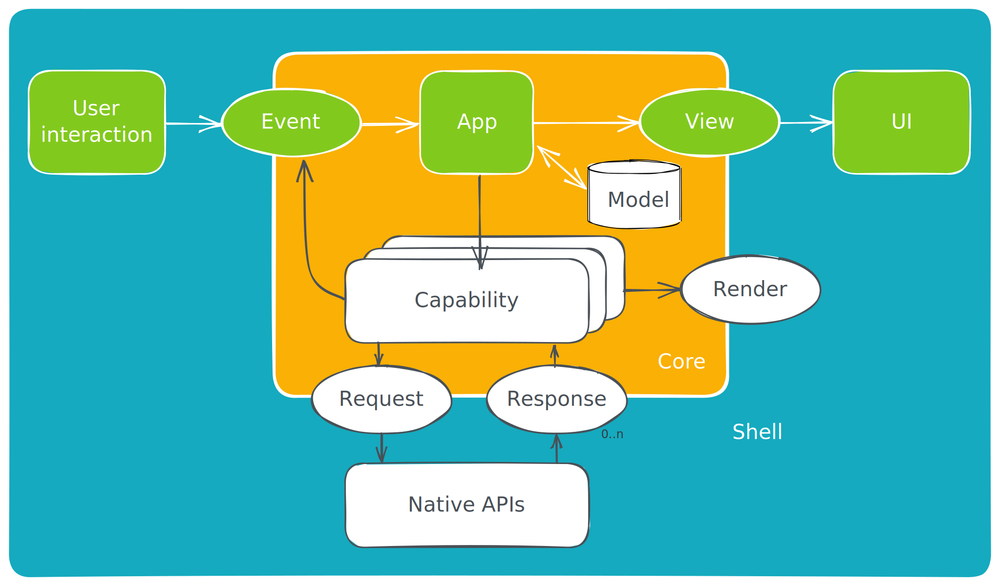

# [Crux](https://red-badger.com/crux) &middot; [](https://github.com/redbadger/crux/blob/master/LICENSE) [](https://crates.io/crates/crux_core) [](https://docs.rs/crux_core/) [](https://github.com/redbadger/crux/actions)

<a href="https://red-badger.com/crux"></a>

**[Watch the introductory talk](https://www.youtube.com/watch?v=cWCZms92-1g&t=5s) | [Read the book](https://redbadger.github.io/crux) | [Read API docs](https://docs.rs/crux_core/latest/crux_core/) | [Join Zulip community](https://crux-community.zulipchat.com)**

## Cross-platform app development in Rust

- **Shared Core for Behavior** - Crux helps you share your app's business logic
  and behavior across mobile (iOS/Android) and web — as a single reusable core
  built with Rust.
- **Thin Shell for UI** - Crux recognizes that the best experiences are built
  with modern declarative frameworks such as
  [SwiftUI](https://developer.apple.com/xcode/swiftui/),
  [Jetpack Compose](https://developer.android.com/jetpack/compose),
  [React](https://reactjs.org/)/[Vue](https://vuejs.org/), or a WebAssembly
  based framework (like [Leptos](https://leptos.dev/), or
  [Yew](https://yew.rs/)) — however, it aims to keep this UI layer as thin as it
  can be, with all other work done by the shared core.
- **Type Generation** - the interface with the core has static type checking
  across languages — types and serialization code are generated for Swift,
  Kotlin and TypeScript. Rust shells can import the core directly.
- **Managed effects** - Side effects such as calling an API are captured as values
  and executed by the Shell. The core stays side-effect free, making it portable
  across platforms and allowing high-level user journey tests to run in milliseconds
  (rather than minutes or even hours)

## Getting Started

[Learn how to use Crux in your project](https://redbadger.github.io/crux).

Read the [API documentation](https://docs.rs/crux_core/latest/crux_core/)

[Watch the introductory talk](https://www.youtube.com/watch?v=cWCZms92-1g&t=5s)
at the recent [Rust Nation 2023](https://www.rustnationuk.com/) conference in
London.

You can also join the friendly conversation on our
[Zulip channel](https://crux-community.zulipchat.com).

> [!NOTE]
> Crux is pre 1.0 and under active development. It is production-ready, but
> occasional breaking changes to the API can be expected. We do our best to
> limit the extent of these and provide a smooth, gradual migration path

## Architectural Overview



Crux has managed side-effects, it strictly separates pure computational tasks from tasks that
cause side effects. This is similar to the way [Elm](https://guide.elm-lang.org/architecture/) works.

### Side-effect-free core

In the above diagram, the inner "Core" is compiled and linked to the outer
"Shell" on each platform as a library:

- On iOS as a native static library
- On Android as a dynamic library using
  [Java Native Access](https://github.com/java-native-access/jna)
- In a browser as a WebAssembly module

In fact, because WebAssembly (Wasm) is one of the compilation targets, the core
_must_ remain side-effect free, due to the sandboxed nature of the Wasm runtime
environment.

As such, the core is completely isolated and secure against software
supply-chain attacks, as it has no access to any external APIs. All it can do is
perform pure calculations and keep internal state.

Following the Elm architecture, the core defines the key component types within
the application:

- `Event` — an `enum` describing the events which the core can handle
- `Model` — describes the internal state of the application
- `Effect` – the kinds of side-effects the core will request
- `ViewModel` — represents information that should be displayed to the user

The first three are tied together by the `update` function, familiar from Elm,
Redux or other event sourcing architectures, which currently has this type
signature:

```rust,ignore
fn update(
    &self,
    msg: Event,
    model: &mut Model,
    _caps: &Capabilities, // soon to be deprecated
) -> Command<Effect, Event> {
    // ...
}
```

The job of the `update` function is to process an `Event`, update the model
accordingly, and potentially request some side-effects.

<!--prettier-ignore-->
> [!NOTE]
> The `Capability` API is being deprecated in favour of a more flexible `Command` API.
>
> To learn more about the new [`Command` API](https://docs.rs/crux_core/latest/crux_core/command/index.html),
> see the page in the book that describes [Managed Effects](https://redbadger.github.io/crux/guide/effects.html),
> or look at [examples/counter](https://github.com/redbadger/crux/tree/master/examples/counter).

### Application Shell

The enclosing platform native "Shell" is written using the language appropriate
for the platform, and acts as the runtime environment within which all the
non-pure tasks are performed. From the perspective of the core, the shell is the
platform on which the core runs.

### Testing

Tests can act as another Shell, exercising the Core in the same way a real app would,
observing and resolving the requested effects and checking the model and view model
are correct. No need for fakes, mocks or stubs.

## Communication Between the Application Shell and the Core

Following the Elm architecture, the interface with the core is message based.
To perform any task that creates a side-effect (such as an HTTP
call or random number generation), the core must request it from the shell as an `Effect`.
Effects support fire-and-forget, request/response, and streaming semantics.

Crux has a concept of Capabilities — reusable interfaces for common
side-effects which can be used in the Core as a more ergonomic API.

The only built-in capability is `Render`. But this repository contains a few
capabilities at various stages of maturity, and you can easily write your own if
you want to:


### Published capabilities

1. `Render` (ask UI to render the ViewModel) —
   [source](./crux_core/src/capabilities/render.rs), built-in to `crux_core`,
   request only
1. `Http` (full HTTP implementation based on the
   [Surf](https://crates.io/crates/surf) API) — [source](https://github.com/redbadger/crux/tree/master/crux_http),
   [crate](https://crates.io/crates/crux_http), request/response
1. `KeyValue` (basic key-value store API) — [source](https://github.com/redbadger/crux/tree/master/crux_kv),
   [crate](https://crates.io/crates/crux_kv), request/response
1. `Time` (get current time, notify after duration, notify at instant) —
   [source](https://github.com/redbadger/crux/tree/master/crux_time), [crate](https://crates.io/crates/crux_time),
   request/response
1. `Platform` (get the current platform) — [source](https://github.com/redbadger/crux/tree/master/crux_platform),
   [crate](https://crates.io/crates/crux_platform), request/response

### Example custom capabilities

1. `SSE` (basic Server-Sent Events) —
   [source](https://github.com/redbadger/crux/tree/master/examples/counter/shared/src/capabilities/sse.rs),
   request/streaming
1. `PubSub` (pub sub with streaming) —
   [source](https://github.com/redbadger/crux/tree/master/examples/notes/shared/src/capabilities/pub_sub.rs),
   request/response/streaming
1. `Delay` — part of
   [tutorial](https://redbadger.github.io/crux/guide/capability_apis.html#basic-delay-capability)
   in the [book](https://redbadger.github.io/crux)

### Foreign Function Interface with type generation

The core API interface is very minimal:

- `process_event: Event -> Vec<Request>` - processes a user interaction event
  and potentially responds with capability requests. This is the API for the
  _driving_ side in the above diagram.
- `handle_response: (uuid, SomeResponse) -> Vec<Request>` - handles the response
  from the capability and potentially follows up with further requests. This is
  the API for the _driven_ side in the above diagram.
- `view: () -> ViewModel` - provides the shell with the current data for
  displaying user interface


The Foreign Function Interface allowing the shell to call the above functions is
provided by Mozilla's [UniFFI](https://mozilla.github.io/uniffi-rs/) on a mobile
device, or in the browser, by
[wasm-pack](https://rustwasm.github.io/wasm-pack/).

In order to both send more complex data than UniFFI currently supports, and
enforce the message passing semantics, all messages are serialized, sent across
the boundary, then deserialized using
[serde-generate](https://docs.rs/serde-generate/latest/serde_generate/) which
also provides type generation for the foreign (non-Rust) languages.

This means that changes to types in the core, especially the `Event` and
`Request` types, propagate out into the shell implementations and cause type
errors where appropriate (such as an exhaustive match on an enum check).

### Message Types

Three types of message are exchanged between the application and the core.

- Messages of type `Event` are sent from the Shell to the Core in response to an
  event happening in the user interface (the _driving_ side). They start a
  potential sequence of further message exchanges between the shell and the
  core. Messages are passed on unchanged.
- Messages of type `Request` are sent from the Core to the Shell to request the
  execution of some side-effect-inducing task. The Core responds with zero or
  more `Request` messages after receiving an `Event` message (the _driven_
  side).
- Response messages are sent from the Shell to the Core carrying the result of
  an earlier request.

`Request` messages contain the inputs for the requested side-effect, along with
a `id` used by the core to pair requests and their responses together. The
exact mechanics are not important, but it is important for the request's `id`
to be passed on to the corresponding response.

## Example Message Exchange Cycle

A typical message exchange cycle may look like this:

1. User interaction occurs in the Shell, which results in an event
1. The Shell handles this event by constructing an `Event`
1. The Shell calls the Core's `process_event` function passing the `Event` as an
   argument
1. The Core performs the required processing, updating both its inner state and
   the view model
1. The Core returns one or more `Request` messages to the Shell (inside an enum
   tagging the type of request)

In the simplest case, the Core will respond to an `Event` by returning the
single `Request` - render.

This requests that the Shell re-renders the user interface. When `Render` is the
only response from the Core, the message cycle has completed and the Core has
now "settled".

In more complex cases however, the Core may well return multiple `Request`s;
each of which instructs the Shell to perform a side-effect-inducing task such
as:

- Make a network call, or
- Fetch the current date/time stamp, or
- Perform biometric authentication, or
- Obtain an image from the camera, or
- Whatever else you can think of...

Many of these side-effecting-inducing tasks are asynchronous. The Shell is
responsible for passing responses back to the core (to the `handle_response`
function), which may respond with further requests.

This exchange continues until the core stops requesting further side-effects
(typically the last side-effect requested would again be `Render`).

---

## Sponsors

Crux is kindly sponsored by the following organizations. Your help is very much
appreciated.

---

### Red Badger Consulting Limited


[Red Badger](https://red-badger.com/) is the digital product consultancy trusted
by blue chips and global brands. Our product design and technical pedigree allow
us to craft high-impact digital products customers want. We use modern
engineering approaches to deliver sustainable change. And embed digital
capabilities to power continuous innovation.

---

### Zulip


[Zulip](https://zulip.com/) is an open-source modern team chat app designed to
keep both live and asynchronous conversations organized.

Zulip sponsor Crux by providing our
[Zulip server](https://crux-community.zulipchat.com) — thank you Zulip!

---
