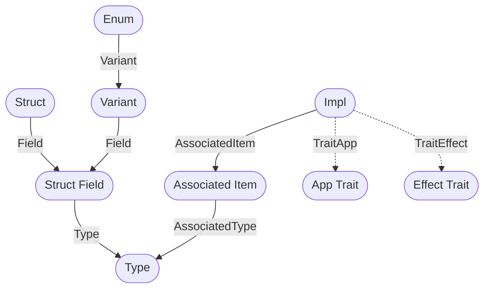

# Crux CLI codegen for foreign types

The codegen command on the `crux` CLI generates code for foreign types in Swift,
Kotlin and TypeScript.

<!-- prettier-ignore -->
> [!NOTE]
> This is a work in progress and is not yet ready for general use.

```sh
crux codegen --lib shared
```

The `--lib` flag specifies the library to generate code for. The `shared`
library is used in this example.

## How it works

### Source data

Generate `rustdoc` JSON for the library, using a command like this:
```sh
RUSTC_BOOTSTRAP="1" RUSTDOCFLAGS="-Z unstable-options --output-format=json --cap-lints=allow" \
cargo doc \
    --no-deps \
    --lib \
    --manifest-path shared/Cargo.toml \
    --all-features \
    --document-private-items
```

The JSON output describes all the public and private items in the library and is deserialized
using the [`rustdoc-types`][rustdocTypesReference] crate.

### Build a graph



Process the data using the [`ascent`][ascentCrateReference] crate to run a logic
program (similar to Datalog) on the items, summaries and crates that are listed in the JSON.

We find any structs that implement the `App` trait, and build a hierarchy of those, so that we can determine which one is the root app.

We then dig into its associated items to find the ViewModel, Event, and Effect (with each effect's Operation and Output).

We also find any foreign crates that are needed and queue them for processing.

### Create an intermediate representation

Finally we take the set of edges we are interested in and use them to build an intermediate representation that is compatible with the [`serde_generate`][serdeGenerateReference] crate. This allows us to use the same backend that we are currently using in order to maintain backwards compatibility.

### Generate foreign types

The IR is used to generate code for foreign types in Swift, Kotlin and
TypeScript, via a vendored version of the
[`serde_generate`][serdeGenerateReference] crate.

We will likely want to change this in the future to allow us to generate more
idiomatic code for each language, and support Crux more fully.

[ascentCrateReference]: https://crates.io/crates/ascent
[rustdocJsonReference]: https://crates.io/crates/rustdoc-json
[rustdocTypesReference]: https://crates.io/crates/rustdoc-types
[serdeGenerateReference]: https://crates.io/crates/serde-generate
