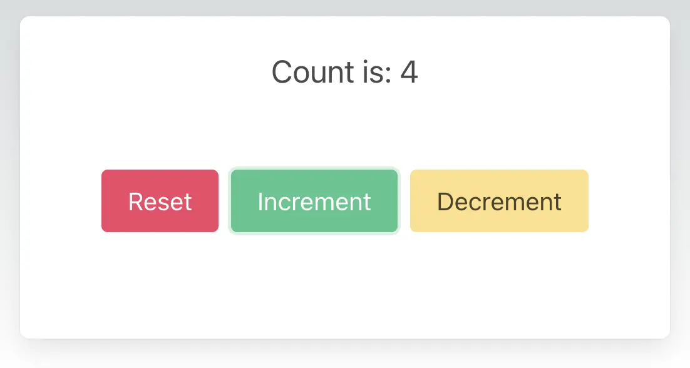

# Web — TypeScript and React (Next.js)

These are the steps to set up and run a simple TypeScript Web app that calls into a shared core.

```admonish
This walk-through assumes you have already added the `shared` and `shared_types` libraries to your repo, as described in [Shared core and types](./core.md).
```

```admonish info
There are many frameworks available for writing Web applications with JavaScript/TypeScript. We've chosen [React](https://reactjs.org/) with [Next.js](https://nextjs.org/) for this walk-through because it is simple and popular. However, a similar setup would work for other frameworks.
```

## Create a Next.js App

For this walk-through, we'll use the [`pnpm`](https://pnpm.io/) package manager for no reason other than we like it the most!

Let's create a simple Next.js app for TypeScript, using `pnpx` (from `pnpm`). You can accept all the defaults.

```sh
pnpx create-next-app@latest web-nextjs --ts --use-pnpm
```

Then we can change to the project directory and start adding dependencies.

```sh
cd web-nextjs
```

## Compile our Rust shared library

When we build our app, we also want to compile the Rust core to WebAssembly so that it can be referenced from our code.

To do this, we'll use [`wasm-pack`](https://rustwasm.github.io/wasm-pack/installer/), which you can install like this:

```sh
# with homebrew
brew install wasm-pack

# or directly
curl https://rustwasm.github.io/wasm-pack/installer/init.sh -sSf | sh
```

But we won't call `wasm-pack` directly. Instead we'll use a Next.js plugin to do this for us. That way the shared library will be compiled to WebAssembly when we build our app using `pnpm`.

Add the `wasm-pack-plugin` to our project:

```sh
pnpm install --save-dev @wasm-tool/wasm-pack-plugin
```

We'll need to configure Next.js to call the plugin by editing `web-nextjs/next.config.js` to look like this:

```javascript
const WasmPackPlugin = require("@wasm-tool/wasm-pack-plugin");
const path = require("path");

// see https://github.com/wasm-tool/wasm-pack-plugin/issues/112
let loaded = false;

/** @type {import('next').NextConfig} */
const nextConfig = {
  reactStrictMode: true,
  webpack(nextConfig) {
    if (!loaded) {
      nextConfig.plugins.push(
        new WasmPackPlugin({
          crateDirectory: path.resolve(__dirname, "..", "shared"),
          extraArgs: "--target web",
          outDir: path.resolve(__dirname, "shared", "core"),
        })
      );
      loaded = true;
    }

    return nextConfig;
  },
};

module.exports = nextConfig;
```

## Add the Shared Types

To generate the shared types for TypeScript, we can just run `cargo build` from the root of our repository. You can check that they have been generated correctly:

```sh
ls --tree shared_types/generated/typescript
shared_types/generated/typescript
├── bincode
│  ├── bincodeDeserializer.d.ts
│  ├── bincodeDeserializer.js
│  ├── bincodeDeserializer.ts
│  ├── bincodeSerializer.d.ts
│  ├── bincodeSerializer.js
│  ├── bincodeSerializer.ts
│  ├── mod.d.ts
│  ├── mod.js
│  └── mod.ts
├── node_modules
│  └── typescript -> .pnpm/typescript@4.8.4/node_modules/typescript
├── package.json
├── pnpm-lock.yaml
├── serde
│  ├── binaryDeserializer.d.ts
│  ├── binaryDeserializer.js
│  ├── binaryDeserializer.ts
│  ├── binarySerializer.d.ts
│  ├── binarySerializer.js
│  ├── binarySerializer.ts
│  ├── deserializer.d.ts
│  ├── deserializer.js
│  ├── deserializer.ts
│  ├── mod.d.ts
│  ├── mod.js
│  ├── mod.ts
│  ├── serializer.d.ts
│  ├── serializer.js
│  ├── serializer.ts
│  ├── types.d.ts
│  ├── types.js
│  └── types.ts
├── tsconfig.json
└── types
   ├── shared_types.d.ts
   ├── shared_types.js
   └── shared_types.ts
```

You can see that it also generates an `npm` package that we can add directly to our project.

```sh
pnpm add ../shared_types/generated/typescript
```

## Create some UI

### Hello World counter example

```admonish example
There are several [examples](https://github.com/redbadger/crux/tree/master/examples) of Next.js apps in the Crux repository.

However, the simplest example is the [Hello World counter example](https://github.com/redbadger/crux/tree/master/examples/hello_world) — it only has `shared` and `shared_types` libraries, which will work with the following example code.
```

Edit `web-nextjs/src/pages/index.tsx` to look like this:

```typescript
import type { NextPage } from "next";
import Head from "next/head";
import { useEffect, useState } from "react";

import init_core, { process_event as sendEvent, view } from "../../shared/core";
import * as types from "shared_types/types/shared_types";
import * as bincode from "shared_types/bincode/mod";

interface Event {
  kind: "event";
  event: types.Event;
}

type State = {
  count: string;
};

const initialState: State = {
  count: "",
};

function deserializeRequests(bytes: Uint8Array) {
  let deserializer = new bincode.BincodeDeserializer(bytes);

  const len = deserializer.deserializeLen();

  let requests: types.Request[] = [];

  for (let i = 0; i < len; i++) {
    const request = types.Request.deserialize(deserializer);
    requests.push(request);
  }

  return requests;
}

const Home: NextPage = () => {
  const [state, setState] = useState(initialState);

  const dispatch = (action: Event) => {
    const serializer = new bincode.BincodeSerializer();
    action.event.serialize(serializer);
    const requests = sendEvent(serializer.getBytes());
    handleRequests(requests);
  };

  const handleRequests = async (bytes: Uint8Array) => {
    let requests = deserializeRequests(bytes);

    for (const { uuid: _, effect } of requests) {
      switch (effect.constructor) {
        case types.EffectVariantRender:
          let bytes = view();
          let viewDeserializer = new bincode.BincodeDeserializer(bytes);
          let viewModel = types.ViewModel.deserialize(viewDeserializer);

          setState({
            count: viewModel.count,
          });

          break;
      }
    }
  };

  useEffect(() => {
    async function loadCore() {
      await init_core();

      // Initial event
      dispatch({
        kind: "event",
        event: new types.EventVariantReset(),
      });
    }

    loadCore();
  }, []);

  return (
    <>
      <Head>
        <title>Next.js Example</title>
      </Head>

      <main>
        <section className="box container has-text-centered m-5">
          <p className="is-size-5">{state.count}</p>
          <div className="buttons section is-centered">
            <button
              className="button is-primary is-danger"
              onClick={() =>
                dispatch({
                  kind: "event",
                  event: new types.EventVariantReset(),
                })
              }
            >
              {"Reset"}
            </button>
            <button
              className="button is-primary is-success"
              onClick={() =>
                dispatch({
                  kind: "event",
                  event: new types.EventVariantIncrement(),
                })
              }
            >
              {"Increment"}
            </button>
            <button
              className="button is-primary is-warning"
              onClick={() =>
                dispatch({
                  kind: "event",
                  event: new types.EventVariantDecrement(),
                })
              }
            >
              {"Decrement"}
            </button>
          </div>
        </section>
      </main>
    </>
  );
};

export default Home;
```

Now all we need is some CSS. Edit `examples/hello_world/web-nextjs/src/pages/_document.tsx` to look like this:

```typescript
import { Html, Head, Main, NextScript } from "next/document";

export default function Document() {
  return (
    <Html>
      <Head>
        <link
          rel="stylesheet"
          href="https://cdn.jsdelivr.net/npm/bulma@0.9.4/css/bulma.min.css"
        />
      </Head>
      <body>
        <Main />
        <NextScript />
      </body>
    </Html>
  );
}
```

## Build and serve our app

We can build our app, and serve it for the browser, in one simple step.

```sh
pnpm dev
```

```admonish success
Your app should look like this:

<p align="center"></p>
```
