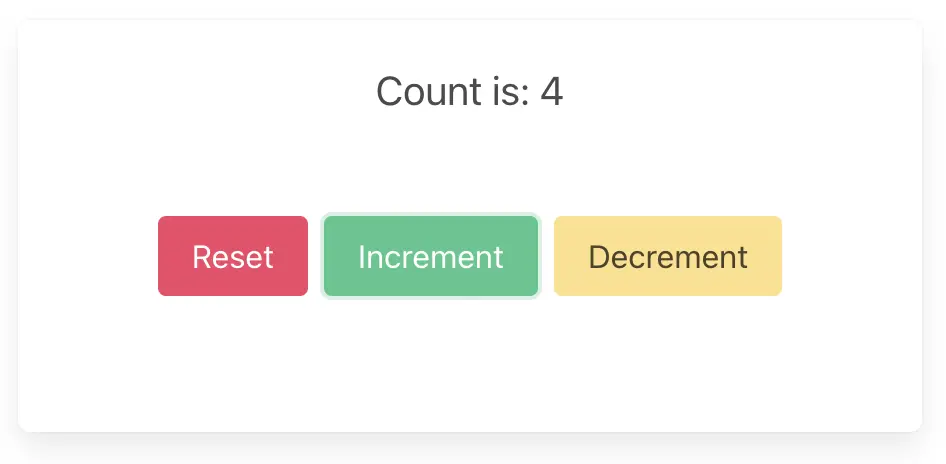

# Web — Rust and Yew

These are the steps to set up and run a simple Rust Web app that calls into a shared core.

```admonish
This walk-through assumes you have already added the `shared` and `shared_types` libraries to your repo, as described in [Shared core and types](./core.md).
```

```admonish info
There are many frameworks available for writing Web applications in Rust. We've chosen [Yew](https://yew.rs/) for this walk-through because it is arguably the most mature. However, a similar setup would work for any framework that compiles to WebAssembly.
```

## Create a Yew App

Our Yew app is just a new Rust project, which we can create with Cargo. For this example we'll call it `web-yew`.

```sh
cargo new web-yew
```

We'll also want to add this new project to our Cargo workspace, by editing the root `Cargo.toml` file.

```toml
[workspace]
members = ["shared", "web-yew"]
```

Now we can `cd` into the `web-yew` directory and start fleshing out our project. Let's add some dependencies to `shared/Cargo.toml`.

```toml
[package]
name = "web-yew"
version = "0.1.0"
edition = "2021"

[dependencies]
shared = { path = "../shared" }
yew = { version = "0.20.0", features = ["csr"] }
```

We'll also need a file called `index.html`, to serve our app.

```html
<!DOCTYPE html>
<html>
  <head>
    <meta charset="utf-8" />
    <meta name="viewport" content="width=device-width, initial-scale=1" />
    <title>Yew App</title>
    <link
      rel="stylesheet"
      href="https://cdn.jsdelivr.net/npm/bulma@0.9.4/css/bulma.min.css"
    />
  </head>
</html>
```

## Create some UI

### Hello World counter example

```admonish example
There are several [examples](https://github.com/redbadger/crux/tree/master/examples) of Yew apps in the Crux repository.

However, the simplest example is the [Hello World counter example](https://github.com/redbadger/crux/tree/master/examples/hello_world) — it only has `shared` and `shared_types` libraries, which will work with the following example code.
```

Edit `src/main.rs` to look like this:

```rust,noplayground
use std::rc::Rc;

use anyhow::Result;
use futures::{stream, TryStreamExt};
use gloo_net::http;
use wasm_bindgen::JsValue;
use yew::{html::Scope, prelude::*};

use shared::{
    http::protocol::{HttpHeader, HttpRequest, HttpResponse},
    sse::{SseRequest, SseResponse},
    App, Capabilities, Core, Effect, Event,
};

#[derive(Default)]
struct RootComponent {
    core: Rc<Core<Effect, App>>,
}

enum Task {
    Event(Event),
    Effect(Effect),
}

fn send_effects(link: &Scope<RootComponent>, effects: Vec<Effect>) {
    link.send_message_batch(effects.into_iter().map(Task::Effect).collect());
}

impl Component for RootComponent {
    type Message = Task;
    type Properties = ();

    fn create(ctx: &Context<Self>) -> Self {
        let link = ctx.link();
        link.send_message(Task::Event(Event::StartWatch));

        Self {
            core: Rc::new(Core::new::<Capabilities>()),
        }
    }

    fn update(&mut self, ctx: &Context<Self>, msg: Self::Message) -> bool {
        let link = ctx.link();
        let core = &self.core;

        match msg {
            Task::Event(event) => send_effects(link, core.process_event(event)),
            Task::Effect(effect) => match effect {
                Effect::Render(_) => return true,
            },
        };

        false
    }

    fn view(&self, ctx: &Context<Self>) -> Html {
        let link = ctx.link();
        let view = self.core.view();

        html! {
            <>
                <section class="section has-text-centered">
                    <p class="title">{"Crux Counter Example"}</p>
                </section>
                <section class="section has-text-centered">
                    <p class="is-size-5">{"Rust Core, Rust Shell (Yew)"}</p>
                </section>
                <section class="container has-text-centered">
                    <p class="is-size-5">{&view.text}</p>
                    <div class="buttons section is-centered">
                        <button class="button is-primary is-warning"
                            onclick={link.callback(|_| Task::Event(Event::Decrement))}>
                            {"Decrement"}
                        </button>
                        <button class="button is-primary is-danger"
                            onclick={link.callback(|_| Task::Event(Event::Increment))}>
                            {"Increment"}
                        </button>
                    </div>
                </section>
            </>
        }
    }
}

fn main() {
    yew::Renderer::<RootComponent>::new().render();
}
```

## Build and serve our app

The easiest way to compile the app to WebAssembly and serve it in our web page is to use [`trunk`](https://trunkrs.dev/), which we can install with [Homebrew](https://brew.sh/) (`brew install trunk`) or Cargo (`cargo install trunk`).

We can build our app, serve it and open it in our browser, in one simple step.

```sh
trunk serve --open
```

```admonish success
Your app should look like this:

<p align="center"></p>
```
