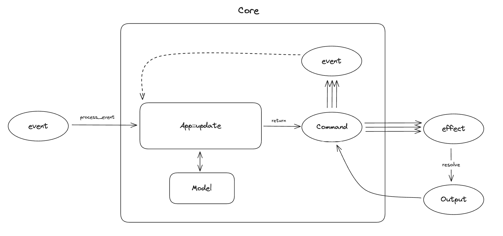

# Managed Effects

The approach to side-effects Crux uses is sometimes called **managed**
side-effects. Your app's core is not allowed to perform side-effects directly.
Instead, whenever it wants to interact with the outside world, it needs to
request the interaction from the shell.

The abstraction Crux uses to capture the potentially complex orchestration of effects
in response to an event is a type called `Command`.

Think of your whole app as a robot, where the Core is the brain of the robot and
the Shell is the body of the robot. The brain instructs the body through
commands and the body passes information about the outside world back to it
with Events.

In this chapter we will explore how commands are created and used, before the next chapter, where we
dive into capabilities, which provide a convenient way to create common commands.

```admonish warning title="Capability API Migration"
The side-effect API is undergoing a migration. The migration is happening in stages:

1. ~Enable the Command API~ ✅ done
2. ~Add Command based APIs to published capabilities~ ✅ done
3. ~Allow apps to avoid `Capabilities` type~ ✅ done
3. Later: Deprecate and remove original capability support

If you're looking for migration instructions, you can find them a the [bottom of this page](#migrating-from-previous-versions-of-crux).
```

## Note on intent and execution

Managed effects are the key to Crux being portable across as many platforms as
is sensible. Crux apps are, in a sense, built in the abstract, they describe
_what_ should happen in response to events, but not _how_ it should happen. We
think this is important both for portability, and for testing and general
separation of concerns. What should happen is inherent to the product, and
should behave the same way on any platform – it's part of what your app _is_.
How it should be executed (and exactly what it looks like) often depends on the
platform.

Different platforms may support different ways, for example a biometric
authentication may work very differently on various devices and some may not
even support it at all. Different platforms may also have different practical restrictions: while it may be
perfectly appropriate to write things to disk on one platform, but internet
access can't be guaranteed (e.g. on a smart watch), on another, writing to disk
may not be possible, but internet connection is virtually guaranteed (e.g. in an
API service, or on an embedded device in a factory). The specific storage solution
for persistent caching would be implemented differently on different platforms,
but would potentially share the key format and eviction strategy across them.

The hard part of designing effects is working out exactly where to draw the line  between what is the intent and what is the implementation detail, what's common across platforms and what may be different on each, and implementing the former in Rust as a set of types, and the latter on the native side in the Shell, however is appropriate.

Because Effects define the "language" used to express intent, your Crux application code can
be portable onto any platform capable of executing its effect in some way.
Clearly, the number of different effects we can think of, and platforms we can
target is enormous, and Crux doesn't want to force you to implement the entire
portfolio of them on every platform.

Instead, your app is expected to define an `Effect` type which covers the kinds of
effects which your app needs in order to work, and every time it responds to an Event,
it is expected to return a `Command`.

```admonish question title="Why not return an Effect?"
Good question - it seems logical at first to return a single Effect, but in practice, we often want to do a lot more than a single effect, it can easily be a complicated orchestration of several effects in parallel, some of which race each other or follow each other in a chain.

This is the reason we introduce one more layer in between: commands
```

## What is a Command

The Command is a recipe for a side-effects workflow which may perform several
effects and also send events back to the app.



Crux expects a Command to be returned by the `update` function. A basic Command will result in an effect request to the Shell, and when the request is _resolved_ by the Shell, the Command will pass the output to the app in an Event. The interaction can be more complicated than this, however. You can imagine a command running a set of Effects concurrently (say a few http requests and a timer), then follow some of them with additional effects based on their outputs, and finally send an event with the result of some of the outputs combined. So in principle, Command is a state machine which emits effects (for the Shell) and Events (for the app) according to the internal logic of what needs to be accomplished.

`Command` provides APIs to iterate over the effects and events emitted so far. This API can be used both in tests and in Rust-based shells, and for some advanced use cases when composing applications.

A basic test using the Command API may look like this:

```rust,ignore
{{#include ../../../crux_core/src/command/tests/basic_effects.rs:basic_test}}
```

## Effects and Events

Each effect carries a request for an Operation (e.g. a HTTP request), which can be inspected and resolved with an operation output (e.g. a HTTP response). After effect requests are resolved, the command may have further effect requests or events, depending on the recipe it's executing.

Types acting as an Operation must implement the [`crux_core::capability::Operation`](https://docs.rs/crux_core/latest/crux_core/capability/trait.Operation.html) trait, which ties them to the type of output. These two types are the protocol between the core and the shell when requesting and resolving the effects. The other types involved in the exchange are various wrappers to enable the operations to be defined in separate crates. The operation is first wrapped in a `Request`, which can be `resolve`d, and then again with an `Effect`. `Effect` is typically an enum defined by your app, which has a variant for each type of effect your app emits. This allows multiple Operation types to coexist, and also enables the Shells to "dispatch" to the right implementation to handle them.

The `Effect` type is typically defined with the help of the `#[effect]` macro, like this:

```rust,ignore
{{#include ../../../examples/cat_facts/shared/src/app.rs:effect}}
```

The above effect type supports five different kinds of side effects. The five operations involved are actually defined by five different Capabilities, so lets talk about those.

This type can now be assigned to the `Effect` associated type in your `App` implementation.

## Capabilities

Capabilities are developer-friendly, ergonomic APIs to construct commands, from
very basic ones all the way to complex stateful orchestrations. Capabilities are an abstraction layer that bundles related operations together with code to create them, and cover one kind of a side-effect (e.g. HTTP, or timers).

We will look at writing capabilities in the next chapter, but for now, it's useful to know that their API often doesn't return `Commands` straight away, but instead returns command builders, which can be converted into a Command, or converted into a future and used in an `async` context.

To help that make more sense, lets look at how Commands are typically used.


## Working with Commands

The intent behind the command API is to cover 80% of effect orchestration without asking developers to use `async` Rust. We will look at the `async` use in a minute, but first lets look at what can be done without it.

A typical use of a `Command` in an update function will look something like this:

```rust,ignore
Http::get(API_URL)
    .expect_json()
    .build()
    .then_send(Event::ReceivedResponse),
```

This code is using a HTTP capability and its API up to the `.build()` call which returns a CommandBuilder. The `.then_send` part is building the command by binding it to an Event to send the output of the request back to the app.

Another example might be:

```rust,ignore
Time::now().then_send(Event::CurrentTime)
```

the `now()` call again returns a command builder, which is used to create a command with `.then_send()`.

One special, but common case of creating a command is creating a Command which does nothing, because there are no more side-effects:

```rust.ignore
Command::done()
```

Soon enough, your app will get a little more complicated, you will need to run multiple commands concurrently, but your `update` function
only returns a single value. You can combine existing commands into one using either the `all` function, or the `.and` method.

For example (from the Cat facts example):

```rust,ignore
{{#include ../../../examples/cat_facts/shared/src/app.rs:command_all}}

```

This uses two different capabilities to create three commands, then runs all of them concurrently. The result is another `Command`, which can be returned from `update`.

```admonish note
Commands (or more precisely command builders) can be created without capabilities, and indeed capabilities do this. You shouldn't really need this in your app code, so we will cover that side of Commands in the next chapter, when we look at building Capabilities.
```

You might also want to run effects in a sequence, passing output of one as the input of another. This is another thing the command builders can facilitate.

## Command builders

Command builders come in three flavours:
* [RequestBuilder](https://docs.rs/crux_core/latest/crux_core/command/struct.RequestBuilder.html) - the most common, builds a request expecting a single response from the shell (think HTTP client)
* [StreamBuilder](https://docs.rs/crux_core/latest/crux_core/command/struct.StreamBuilder.html) - builds a request expecting a (possibly infinite) sequence of responses from the shell (think WebSockets)
* [NotificationBuilder](https://docs.rs/crux_core/latest/crux_core/command/struct.NotificationBuilder.html) - builds a shell notification, which does not expect a response. The best example is notifying the shell that a new view model is available

All builders share a common API. Request and stream builder can be converted into commands with a `.then_send`.

Both also support `.then_request` and `.then_stream` calls, for chaining on a function which takes the output of the first builder and returns a new builder. This can be used to build things like automatic pagination through an API for example.

You can also `.map` the output of the request/stream to a new value.

Combining all these tools provides a fair bit of flexibility to create fairly complex orchestrations of effects. Sometimes, you might want to go more complex than that however. In such cases, us attempting to create more APIs trying to achieve every conceivable orchestration with closures would have diminishing returns. In such cases, you probably want to write `async` code instead.

For more details of this, we recommend the [Command API docs](https://docs.rs/crux_core/latest/crux_core/command/index.html).

```admonish warning
Notice that nowhere in the above examples have we mentioned working with the model during the execution of the command. This is very much by design: Once started, commands do not have model access, because they execute asynchronously, possibly in parallel, and access to model would introduce data races, which are very difficult to debug.

In order to update state, you should pass the result of the effect orchestration back to your app using an Event (as a kind of callback). It's relatively typical for apps to have a number of "internal" events, which handle results of effects. Sometimes these are also useful in tests, if you want to start a particular journey "from the middle".
```

## Commands with `async`

The real power of commands comes from the fact that they build on `async` Rust. Each Command is a little async executor, which runs a number of tasks. The tasks get access to the crux context (represented by [`CommandContext`](https://docs.rs/crux_core/latest/crux_core/command/struct.CommandContext.html)), which gives them the ability to communicate with the shell and with the app.

You can create a raw command like this:

```rust,ignore
Command::new(|ctx| async move {
    let output = ctx.request_from_shell(AnOperation::One).await;
    ctx.send_event(Event::Completed(output));
    let output = ctx.request_from_shell(AnOperation::Two).await;
    ctx.send_event(Event::Completed(output));
});
```

`Command::new` takes a closure, which receives the CommandContext and returns a future, which will become the Command's main task (it is not expected to return anything, it's `Output` is `()`. The provided context can be used to start shell requests, streams, and send events back to the app.

The Context can also be used to `spawn` more tasks in the command.

There is a very similar async API in command builders too, except the returned future/stream is expected to return a value.

Builders can be converted into a future/stream for use in the `async` blocks with `.into_future(ctx)` and `.into_stream(ctx)`, so long as you hold an instance of a `CommandContext` (otherwise those futures/streams would have no ability to communicate with the shell or the app).

```admonish warning title="Crux async vs Tokio, async-std et al."
While commands do execute on an async runtime, the runtime does not run on its own - it's part of the core and needs to be _driven_ by the Shell calling the Core APIs. We use `async` rust as a convenient way to build the cooperative multi-tasking state machines involved in managing side effects.

This is also why combining the Crux async runtime with something like Tokio will appear to somewhat work (because the futures involved are mostly compatible), but it will have odd stop-start behaviours, because the Crux runtime doesn't run all the time, and some futures won't work, because they require Tokio support.

That said, a lot of universal async code (like async channels for example), work just fine.
```

There is more to the `async` effect API than we can or should cover here. Most of what you'd expect in async rust is supported – join handles, aborting tasks (and even Commands), spawning tasks and communicating between them, etc. Again, we recommend the API docs for the full coverage

## Migrating from previous versions of Crux

The migration from the previous API is in two steps - first, make your app compatible with newer versions of Crux, then, when you're done with migrating your effect handling, move away from using `Capabilities`.

The change to `Command` is a breaking one for all Crux apps, but the fix is
quite minimal.

There are two parts to it:

1. declare the `Effect` type on your App
2. return `Command` from `update`

Here's an example:

```rust
impl crux_core::App for App {
    type Event = Event;
    type Model = Model;
    type ViewModel = ViewModel;

    type Capabilities = Capabilities;
    type Effect = Effect; // 1. add the associated type

    fn update(
        &self,
        event: Event,
        model: &mut Model,
        caps: &Capabilities,
    ) -> crux_core::Command<Effect, Event> {
        crux_core::Command::done() // 2. return a Command
    }
}

```

In a typical app the `Effect` will be derived from `Capabilities`, so the added
line should just work.

To begin with, you can simply return a `Command::done()` from the `update`
function. `Command::done()` is a no-op effect.
