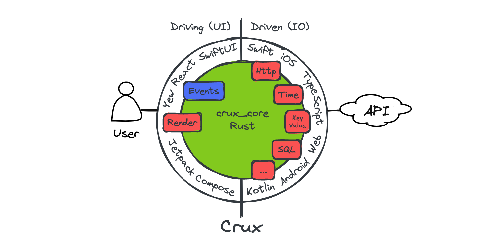
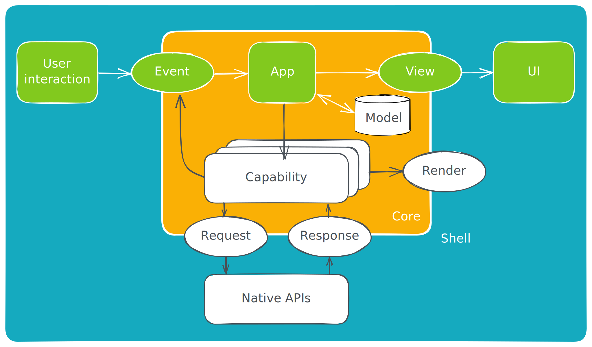

# Overview

Crux is a framework for building cross-platform applications
with better testability, higher code and behavior reuse, better safety,
security, and more joy from better tools.

It splits the application into two distinct parts, a Core built in Rust, which
drives as much of the business logic as possible, and a Shell, built in the
platform native language (Swift, Kotlin, TypeScript), which provides all
interfaces with the external world, including the human user, and acts as a
platform on which the core runs.



The interface between the two is a native FFI (Foreign Function Interface) with
cross-language type checking and message passing semantics, where simple data
structures are passed across the boundary.

```admonish title="Get to know Crux"
To get playing with Crux quickly, follow the [Getting Started](./getting_started/core.md) steps. If you prefer to read more about how apps are built in Crux first, read the [Development Guide](./guide/hello_world.md). And if you'd like to know what possessed us to try this in the first place, read about our [Motivation](./motivation.md).

There are two places to find API documentation: the latest published version on docs.rs, and we also have the very latest master docs if you too like to live dangerously.

- **crux_core** - the main Crux crate: [latest release](https://docs.rs/crux_core/latest/crux_core/) | [latest master](https://redbadger.github.io/crux/master_api_docs/crux_core/)
- **crux_http** - HTTP client capability: [latest release](https://docs.rs/crux_http/latest/crux_http/) | [latest master](https://redbadger.github.io/crux/master_api_docs/crux_http/)
- **crux_kv** - Key-value store capability: [latest release](https://docs.rs/crux_kv/latest/crux_kv/) | [latest master](https://redbadger.github.io/crux/master_api_docs/crux_kv/)
- **crux_time** - Time capability: [latest release](https://docs.rs/crux_time/latest/crux_time/) | [latest master](https://redbadger.github.io/crux/master_api_docs/crux_time/)

You can see the latest version of this book (generated from the master branch) on [Github Pages](https://redbadger.github.io/crux/latest_master/).

Crux is open source on [Github](https://github.com/redbadger/crux). A good way to learn Crux is to explore the code, play with the [examples](https://github.com/redbadger/crux/tree/master/examples), and raise issues or pull requests. We'd love you to get involved.

You can also join the friendly conversation on our [Zulip channel](https://crux-community.zulipchat.com).
```

## Design overview



The architecture is event-driven, based on
[event sourcing](https://martinfowler.com/eaaDev/EventSourcing.html). The Core
holds the majority of state, which is updated in response to events happening in
the Shell. The interface between the Core and the Shell is message-based.

The user interface layer is built natively, with modern declarative UI
frameworks such as Swift UI, Jetpack Compose and React/Vue or a WASM based
framework on the web. The UI layer is as thin as it can be, and all other
application logic is performed by the shared Core. The one restriction is that
the Core is side–effect free. This is both a technical requirement (to be able
to target WebAssembly), and an intentional design goal, to separate logic from
effects and make them both easier to test in isolation.

The core requests side-effects from the Shell through common
[capabilities](./guide/capabilities.md). The basic concept is that instead of
_doing_ the asynchronous work, the core _describes_ the intent for the work with
data, and passes this to the Shell to be performed. The Shell performs the work,
and returns the outcomes back to the Core. This approach is inspired by
[Elm](https://elm-lang.org/), and similar to how other purely functional
languages deal with effects and I/O (e.g. the IO monad in Haskell). It is also
similar to how iterators work in Rust.

The Core exports types for the messages it can understand. The Shell can call
the Core and pass one of the messages. In return, it receives a set of
side-effect requests to perform. When the work is completed, the Shell sends the
result back into the Core, which responds with further requests if necessary.

Updating the user interface is considered one of the side-effects the Core can
request. The entire interface is strongly typed and breaking changes in the core
will result in build failures in the Shell.

## Goals

We set out to find a better way of building apps
across platforms. You can read more [about our motivation](./motivation.md). The
overall goals of Crux are to:

- Build the majority of the application code once, in Rust
- Encapsulate the _behavior_ of the app in the Core for reuse
- Follow the Ports and Adapters pattern, also known as
  [Hexagonal Architecture](https://alistair.cockburn.us/hexagonal-architecture/)
  to facilitate pushing side-effects to the edge, making behavior easy to test
- Separate the behavior from the look and feel and interaction design
- Use the native UI tool kits to create user experience that is the best fit for
  a given platform

## Path to 1.0

Crux is used in production apps today, and we consider it production ready. However, we still have a number of things to work on to call it 1.0, with a stable API, and other things one would expect from a mature framework.

Below is a list of some of the things we know we want to do before 1.0:

* Improved documentation, code examples, and example apps for newcomers
* Improved onboarding experience, with less boilerplate code that end users have
  to deal with
* Better FFI code generation to enable support for more languages (e.g. C#, Dart, even C++...)
  and in trurn more Shells (e.g. .NET, Flutter) which will also enable Desktop apps for Windows
* Revised capabilities and effects to allow for better, more natural
  [app composition](./guide/composing.md) in larger apps, for composing capabilities,
  and generally for a more ergonomic effect API overall

Until then, we hope you will work with us on the rough edges, and adapt to the necessary
API updates as we evolve. We strive to minimise the impact of changes as much as we can, but before 1.0, some breaking changes will be unavoidable.
