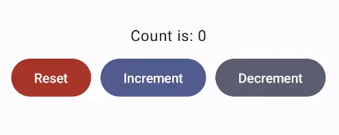

# Android — Kotlin and Jetpack Compose

These are the steps to set up Android Studio to build and run a simple Android
app that calls into a shared core.

```admonish warning title="Sharp edge"
We want to make setting up Android Studio to work with Crux really easy. As time progresses we will try to simplify and automate as much as possible, but at the moment there is some manual configuration to do. This only needs doing once, so we hope it's not too much trouble. If you know of any better ways than those we describe below, please either raise an issue (or a PR) at <https://github.com/redbadger/crux>.
```

```admonish bug title="Rust gradle plugin"
This walkthrough uses Mozilla's excellent [Rust gradle plugin](https://github.com/mozilla/rust-android-gradle)
for Android, which uses Python. However, `pipes` has recently been removed from Python (since Python 3.13)
so you may encounter an error linking your shared library.

If you hit this problem, you can either:

1. use an older Python (<3.13)
2. wait for a fix (see [this issue](https://github.com/mozilla/rust-android-gradle/issues/153))
3. or use a different plugin — there is a [PR in the Crux repo](https://github.com/redbadger/crux/pull/274) that
explores the use of [`cargo-ndk`](https://github.com/bbqsrc/cargo-ndk)
and the [`cargo-ndk-android`](https://github.com/willir/cargo-ndk-android-gradle)
plugin that may be useful.
```

## Create an Android App

The first thing we need to do is create a new Android app in Android Studio.

Open Android Studio and create a new project, for "Phone and Tablet", of type
"Empty Activity". In this walk-through, we'll call it "SimpleCounter"

- "Name": `SimpleCounter`
- "Package name": `com.example.simple_counter`
- "Save Location": a directory called `Android` at the root of our monorepo
- "Minimum SDK" `API 34`
- "Build configuration language": `Kotlin DSL (build.gradle.kts)`

Your repo's directory structure might now look something like this (some files
elided):

```txt
.
├── Android
│  ├── app
│  │  ├── build.gradle.kts
│  │  ├── libs
│  │  └── src
│  │     └── main
│  │        ├── AndroidManifest.xml
│  │        └── java
│  │           └── com
│  │              └── example
│  │                 └── simple_counter
│  │                    └── MainActivity.kt
│  ├── build.gradle.kts
│  ├── gradle.properties
│  ├── local.properties
│  └── settings.gradle
├── Cargo.lock
├── Cargo.toml
├── shared
│  ├── build.rs
│  ├── Cargo.toml
│  ├── src
│  │  ├── app.rs
│  │  ├── lib.rs
│  │  └── shared.udl
│  └── uniffi.toml
├── shared_types
│  ├── build.rs
│  ├── Cargo.toml
│  └── src
│     └── lib.rs
└── target
```

## Add a Kotlin Android Library

This shared Android library (`aar`) is going to wrap our shared Rust library.

Under `File -> New -> New Module`, choose "Android Library" and give it the "Module name"
`shared`. Set the "Package name" to match the one from your
`/shared/uniffi.toml`, which in this example is `com.example.simple_counter.shared`.

Again, set the "Build configuration language" to `Kotlin DSL (build.gradle.kts)`.

For more information on how to add an Android library see
<https://developer.android.com/studio/projects/android-library>.

We can now add this library as a _dependency_ of our app.

Edit the **app**'s `build.gradle.kts` (`/Android/app/build.gradle.kts`) to look like
this:

```gradle
{{#include ../../../../../examples/simple_counter/Android/app/build.gradle.kts}}
```

````admonish
In our gradle files, we are referencing a "Version Catalog" to manage our dependency versions, so you
will need to ensure this is kept up to date.

Our catalog (`Android/gradle/libs.versions.toml`) will end up looking like this:

```toml
{{#include ../../../../../examples/simple_counter/Android/gradle/libs.versions.toml}}
```
````

## The Rust shared library

We'll use the following tools to incorporate our Rust shared library into the
Android library added above. This includes compiling and linking the Rust
dynamic library and generating the runtime bindings and the shared types.

- The [Android NDK](https://developer.android.com/ndk)
- Mozilla's [Rust gradle plugin](https://github.com/mozilla/rust-android-gradle)
  for Android
    - This plugin depends on Python 3, make sure you have a version installed
- [Java Native Access](https://github.com/java-native-access/jna)
- [Uniffi](https://mozilla.github.io/uniffi-rs/) to generate Java bindings

The NDK can be installed from "**Tools, SDK Manager, SDK Tools**" in Android Studio.

Let's get started.

Add the four rust android toolchains to your system:

```sh
$ rustup target add aarch64-linux-android armv7-linux-androideabi i686-linux-android x86_64-linux-android
```

Edit the **project**'s `build.gradle.kts` (`/Android/build.gradle.kts`) to look like
this:

```gradle
{{#include ../../../../../examples/simple_counter/Android/build.gradle.kts}}
```

Edit the **library**'s `build.gradle.kts` (`/Android/shared/build.gradle.kts`) to look
like this:

```gradle
{{#include ../../../../../examples/simple_counter/Android/shared/build.gradle.kts}}

```

```admonish warning title="Sharp edge"
You will need to set the `ndkVersion` to one you have installed, go to "**Tools, SDK Manager, SDK Tools**" and check "**Show Package Details**" to get your installed version, or to install the version matching `build.gradle.kts` above.
```

```admonish tip
When you have edited the gradle files, don't forget to click "sync now".
```

If you now build your project you should see the newly built shared library
object file.

```sh
$ ls --tree Android/shared/build/rustJniLibs
Android/shared/build/rustJniLibs
└── android
   └── arm64-v8a
      └── libshared.so
   └── armeabi-v7a
      └── libshared.so
   └── x86
      └── libshared.so
   └── x86_64
      └── libshared.so
```

You should also see the generated types — note that the `sourceSets` directive
in the shared library gradle file (above) allows us to build our shared library
against the generated types in the `shared_types/generated` folder.

```sh
$ ls --tree shared_types/generated/java
shared_types/generated/java
└── com
   ├── example
   │  └── simple_counter
   │     ├── shared
   │     │  └── shared.kt
   │     └── shared_types
   │        ├── Effect.java
   │        ├── Event.java
   │        ├── RenderOperation.java
   │        ├── Request.java
   │        ├── Requests.java
   │        ├── TraitHelpers.java
   │        └── ViewModel.java
   └── novi
      ├── bincode
      │  ├── BincodeDeserializer.java
      │  └── BincodeSerializer.java
      └── serde
         ├── ArrayLen.java
         ├── BinaryDeserializer.java
         ├── BinarySerializer.java
         ├── Bytes.java
         ├── DeserializationError.java
         ├── Deserializer.java
         ├── Int128.java
         ├── SerializationError.java
         ├── Serializer.java
         ├── Slice.java
         ├── Tuple2.java
         ├── Tuple3.java
         ├── Tuple4.java
         ├── Tuple5.java
         ├── Tuple6.java
         ├── Unit.java
         └── Unsigned.java
```

## Create some UI and run in the Simulator

```admonish example
There is a slightly more advanced
[example](https://github.com/redbadger/crux/tree/master/examples/counter) of an
Android app in the Crux repository.

However, we will use the
[simple counter example](https://github.com/redbadger/crux/tree/master/examples/simple_counter),
which has `shared` and `shared_types` libraries that will work with the
following example code.
```

### Simple counter example

A simple app that increments, decrements and resets a counter.

#### Wrap the core to support capabilities

First, let's add some boilerplate code to wrap our core and handle the
capabilities that we are using. For this example, we only need to support the
`Render` capability, which triggers a render of the UI.

Let's create a file "**File, New, Kotlin Class/File, File**" called `Core`.

```admonish
This code that wraps the core only needs to be written once — it only grows when
we need to support additional capabilities.
```

Edit `Android/app/src/main/java/com/example/simple_counter/Core.kt` to look like
the following. This code sends our (UI-generated) events to the core, and
handles any effects that the core asks for. In this simple example, we aren't
calling any HTTP APIs or handling any side effects other than rendering the UI,
so we just handle this render effect by updating the published view model from
the core.

```swift
{{#include ../../../../../examples/simple_counter/Android/app/src/main/java/com/crux/examples/simplecounter/Core.kt}}
```

```admonish tip
That `when` statement, above, is where you would handle any other effects that
your core might ask for. For example, if your core needs to make an HTTP
request, you would handle that here. To see an example of this, take a look at
the
[counter example](https://github.com/redbadger/crux/tree/master/examples/counter/iOS/CounterApp/core.swift)
in the Crux repository.
```

Edit `/Android/app/src/main/java/com/example/simple_counter/MainActivity.kt` to
look like the following:

```kotlin
{{#include ../../../../../examples/simple_counter/Android/app/src/main/java/com/crux/examples/simplecounter/MainActivity.kt}}
```

```admonish success
You should then be able to run the app in the simulator, and it should look like this:

<p align="center"></p>
```
