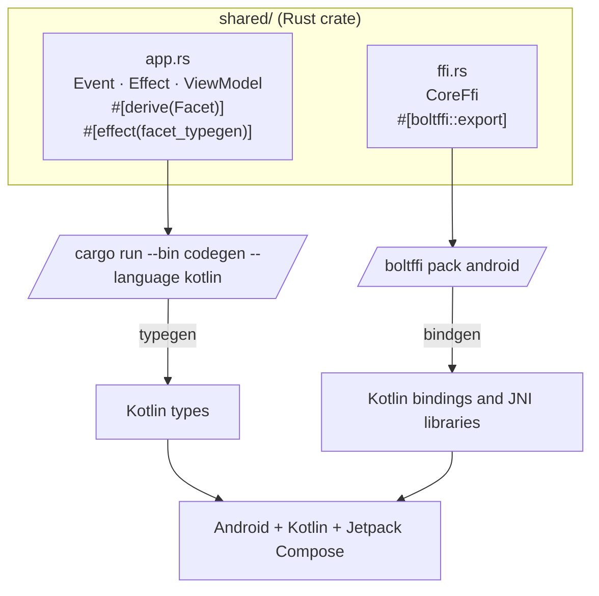
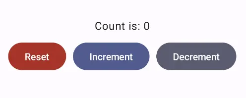

# Android — Kotlin and Jetpack Compose

When we use Crux to build Android apps, the Core API bindings and native
library assets are generated with [BoltFFI](https://www.boltffi.dev/).

The shared types are generated by Crux as Kotlin packages, which we
can add to our Android project using `sourceSets`. The Kotlin code
to serialise and deserialise these types across the boundary is also
generated by Crux.



These are the steps to set up Android Studio to build and run a
simple Android app that calls into a shared core.

```admonish warning title="Sharp edge"
We want to make setting up Android Studio to work with Crux really
easy. As time progresses we will try to simplify and automate as
much as possible, but at the moment there is some manual
configuration to do. This only needs doing once, so we hope it's
not too much trouble. If you know of any better ways than those we
describe below, please either raise an issue (or a PR) at
<https://github.com/redbadger/crux>.
```

## Create an Android App

The first thing we need to do is create a new Android app in Android Studio.

Open Android Studio and create a new project, for "Phone and Tablet", of type
"Empty Activity". In this walk-through, we'll call it "SimpleCounter"

- "Name": `SimpleCounter`
- "Package name": `com.crux.examples.counter`
- "Save Location": a directory called `Android` at the root of our monorepo
- "Minimum SDK" `API 34`
- "Build configuration language": `Kotlin DSL (build.gradle.kts)`

Your repo's directory structure might now look something like this
(some files elided):

```txt
.
├── Android
│  ├── app
│  │  ├── build.gradle.kts
│  │  └── src
│  │     └── main
│  │        ├── AndroidManifest.xml
│  │        └── java/com/crux/examples/counter
│  │           ├── CoreWrapper.kt
│  │           └── MainActivity.kt
│  ├── build.gradle.kts
│  ├── gradle.properties
│  ├── settings.gradle.kts
│  └── shared
│     └── build.gradle.kts
├── Cargo.lock
├── Cargo.toml
└── shared
   ├── Cargo.toml
   ├── boltffi.toml
   └── src
      ├── app.rs
      ├── bin
      │  └── codegen.rs
      ├── ffi.rs
      └── lib.rs
```

## Add a Kotlin Android Library

This shared Android library (`aar`) is going to wrap our shared Rust library.

Under `File -> New -> New Module`, choose "Android Library" and give it the "Module name"
`shared`. Set the "Package name" to match your Android namespace.

Again, set the "Build configuration language" to `Kotlin DSL (build.gradle.kts)`.

For more information on how to add an Android library see
<https://developer.android.com/studio/projects/android-library>.

We can now add this library as a _dependency_ of our app.

Edit the **app**'s `build.gradle.kts` (`/Android/app/build.gradle.kts`) to look like
this:

```kotlin
{{#include ../../../../../examples/counter-tutorial/Android/app/build.gradle.kts}}
```

````admonish
In our Gradle files, we are referencing a "Version Catalog" to manage our dependency versions, so you
will need to ensure this is kept up to date.

Our catalog (`Android/gradle/libs.versions.toml`) will end up looking like this:

```toml
{{#include ../../../../../examples/counter-tutorial/Android/gradle/libs.versions.toml}}
```
````

## The Rust shared library

We'll use the following tools to incorporate our Rust shared library into the
Android library added above. This includes compiling and linking the Rust
dynamic library and generating the runtime bindings and the shared types.

- The [Android NDK](https://developer.android.com/ndk)
- [BoltFFI](https://www.boltffi.dev/) builds the native libraries, generates 
  the Kotlin bindings, and writes the `jniLibs`
- The `codegen` binary (with the `facet_typegen` feature) generates the Kotlin
  app data types

The NDK can be installed from "**Tools, SDK Manager, SDK Tools**" in Android Studio.

Let's get started.

Add the four Rust Android toolchains to your system:

```sh
$ rustup target add aarch64-linux-android armv7-linux-androideabi i686-linux-android x86_64-linux-android
```

Edit the **project**'s `build.gradle.kts` (`/Android/build.gradle.kts`) to look like
this:

```kotlin
{{#include ../../../../../examples/counter-tutorial/Android/build.gradle.kts}}
```

Edit the **library**'s `build.gradle.kts` (`/Android/shared/build.gradle.kts`) to look
like this:

```kotlin
{{#include ../../../../../examples/counter-tutorial/Android/shared/build.gradle.kts}}
```

```admonish warning title="Sharp edge"
You will need to set the `ndkVersion` to one you have installed, go to "**Tools, SDK Manager, SDK Tools**" and check "**Show Package Details**" to get your installed version, or to install the version matching `build.gradle.kts` above.
```

```admonish tip
When you have edited the Gradle files, don't forget to click "sync now".
```

As you can see, The `sourceSets` directive in the shared library Gradle 
file points both `kotlin.srcDirs` and `jniLibs.srcDirs` at the `generated`
directory. Let's populate it.

First generate the data types using `codegen`:

```sh
$ # In `/Android`
$ cargo run --package shared --bin codegen --features codegen,facet_typegen -- --language kotlin --output-dir generated
```

Then generate the bindings and native libraries using BoltFFI:

```sh
$ # In `/shared` 
$ boltffi pack android
```

Now your `generated` directory should look like this:

```sh
$ ls --tree Android/generated
Android/generated
├── build.gradle.kts
├── com
│  ├── crux
│  │  └── examples
│  │     └── counter
│  │        └── Counter.kt
│  └── novi
│     ├── bincode
│     │  ├── BincodeDeserializer.kt
│     │  └── BincodeSerializer.kt
│     └── serde
│        ├── BinaryDeserializer.kt
│        ├── BinarySerializer.kt
│        ├── ...
│        └── UInt128.kt
├── include
│  └── shared.h
├── jniLibs
│  ├── arm64-v8a
│  │  └── libshared.so
│  ├── armeabi-v7a
│  │  └── libshared.so
│  ├── x86
│  │  └── libshared.so
│  └── x86_64
│     └── libshared.so
└── kotlin
   ├── com
   │  └── crux
   │     └── examples
   │        └── counter
   │           └── Shared.kt
   └── jni
      └── jni_glue.c
```

```admonish tip
`codegen` will generate a `build.gradle.kts` that we won't be using in this setup.
Any error reported by the IDE in this file can be ignored, and if the file prevents
buiding it can safely be deleted. The one thing it does tell you is that the
generated Kotlin code needs `kotlinx-coroutines-core`, which the library's
`build.gradle.kts` above already adds.
```

## Create some UI and run in the Simulator

### Wrap the core to handle effects

First, let's add some boilerplate code to wrap our core and handle the
effects that it produces. For this example, we only need to support the
`Render` effect, which triggers a render of the UI.

Let's create a file "**File, New, Kotlin Class/File, File**" called `CoreWrapper`.

```admonish
This code that wraps the core only needs to be written once — it only grows when
we need to support additional effects.
```

Edit `Android/app/src/main/java/com/crux/examples/counter/CoreWrapper.kt` to look like
the following. This code sends our (UI-generated) events to the core, and
handles any effects that the core asks for. In this simple example, we aren't
calling any HTTP APIs or handling any side effects other than rendering the UI,
so we just handle this render effect by updating the published view model from
the core.

```kotlin
{{#include ../../../../../examples/counter-tutorial/Android/app/src/main/java/com/crux/examples/counter/CoreWrapper.kt}}
```

```admonish note title="Why write this by hand?"
The codegen also generates a ready-made `Core` class, in `Counter.kt`, which
runs this loop for you. We write the loop by hand in this chapter on purpose,
because it shows how the shell and the core talk to each other. Ours is called
`CoreWrapper` because the generated `Core` is in the same Kotlin package, and
two classes called `Core` would clash. We pick up the generated `Core` in
[Part II](../../../part-2/shell.md#who-drives-the-loop).
```

```admonish tip
That `when` statement, above, is where you would handle any other
effects that your core might ask for. For example, if your core needs
to make an HTTP request, you would handle that here.
```

Edit `/Android/app/src/main/java/com/crux/examples/counter/MainActivity.kt` to
look like the following:

```kotlin
{{#include ../../../../../examples/counter-tutorial/Android/app/src/main/java/com/crux/examples/counter/MainActivity.kt}}
```

```admonish success
You should then be able to run the app in the simulator, and it should look like this:

<p align="center"></p>
