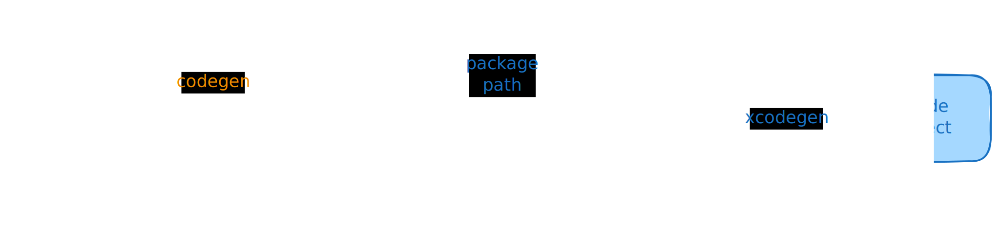
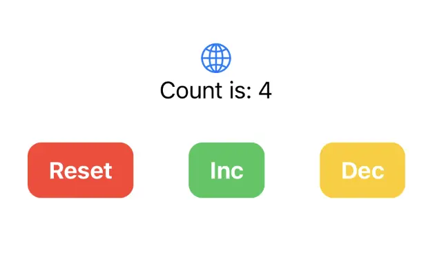

# iOS/macOS with SwiftUI

In this section, we'll set up Xcode to build and run the simple counter app we built so far, targeting both iOS and macOS from a single project.

```admonish tip
We think that using [XcodeGen](https://github.com/yonaskolb/XcodeGen) may be the simplest way to create an Xcode project to build and run a simple Apple app that calls into a shared core.

If you'd rather set up Xcode manually, you can do that, but most of this section will still apply. You just need to
add the Swift package dependencies into your project by hand.
```

When we use Crux to build Apple apps, the Core API bindings are generated in Swift
(with C headers) using Mozilla's [UniFFI](https://mozilla.github.io/uniffi-rs/).

The shared core, which we built in previous chapters, is compiled to a static
library and linked into the app binary.

The shared types are generated by Crux as a Swift package, which we can add to
our project as a dependency. The Swift code to serialize and deserialize
these types across the boundary is also generated by Crux as Swift packages.



## Compile our Rust shared library

When we build our app, we also want to build the Rust core as a static
library so that it can be linked into the binary that we're going to ship.

Other than Xcode and the Apple developer tools, we will use
[`cargo-swift`](https://crates.io/crates/cargo-swift) to generate a
Swift package for our shared library, which we can add in Xcode.

To match our current version of UniFFI, we need to install version 0.9 of `cargo-swift`. You can install it with

```bash
cargo install cargo-swift --version '=0.9'
```

To run the various steps, we'll also use the [Just]() task runner.

```bash
cargo install just
```

Let's write the Justfile and we can look at what happens. Here are
the key tasks (the
[full Justfile](https://github.com/redbadger/crux/blob/master/examples/counter/apple/Justfile)
also includes linting, CI and cleanup targets):

```makefile
# /apple/Justfile

# generates Swift types via codegen binary
typegen:
    cargo run --package shared --bin codegen \
        --features codegen,facet_typegen \
        -- --language swift --output-dir generated

# builds the shared library as a Swift package using cargo-swift
package:
    cargo swift package \
        --name Shared \
        --platforms ios macos \
        --lib-type static \
        --features uniffi

# rebuilds the Xcode project from project.yml
generate-project:
    xcodegen

# generates types, builds shared package, and regenerates Xcode project
generate: typegen package generate-project

# builds the project (generates first)
build: generate
    xcodebuild \
        -project CounterApp.xcodeproj \
        -scheme CounterApp-macOS \
        -configuration Debug \
        build

# local development workflow
dev: build
```

The main task is `dev` which we'll use shortly. It runs `build`,
which in turn runs `typegen`, `package` and `generate-project`.

`typegen` will use the codegen CLI we
[prepared earlier](../../shell.md), and `package` will use
`cargo swift` to create a `Shared` package with our app binary and
the bindgen code. That package will be our Swift interface to the
core.

Finally `generate-project` will run `xcodegen` to give us an Xcode
project file. They are famously fragile files and difficult to
version control, so generating it from a less arcane source of truth
seems like a good idea (yes, even if that source of truth is YAML).

Here's the project file:

```yaml
# /apple/project.yml
{{#include ../../../../../examples/counter/apple/project.yml}}
```

Nothing too special, other than linking a couple packages and using them
as dependencies.

With that, you can run

```bash
just dev
```

Simple - just dev! So what exactly happened?

The core built, including the FFI and the extra CLI binary, which was then called
to generate Swift code, and that was then packaged as a Swift package. You can
look at the `generated` directory, and you'll see two Swift packages - `Shared` and `App`,
just like we asked in `project.yml`. The `Shared` package has our app as a static lib and all the
generated FFI code for our FFI bindings, and the `App` package has the key types we will need.

No need to spend much time in here, but this is all the low-level glue code sorted out.
Now we need to actually build some UI and we can run our app.

## Building the UI

To add some UI, we need to do three things: wrap the core with a simple Swift
interface, build a basic View to give us something to put on screen, and use that
view as our main app view.

### Wrap the core

The generated code still works with byte buffers, so lets give ourselves a nicer
interface for it:

```swift
// apple/CounterApp/core.swift
{{#include ../../../../../examples/counter/apple/CounterApp/core.swift}}
```

This is mostly just serialization code. But the `processEffect` method is interesting.
That is where effect execution goes. At the moment the switch statement has a single
lonely case updating the view model whenever the `.render` variant is requested,
but you can add more in here later, as you expand your `Effect` type.

### Build a basic view

Xcode should've generated a ContentView file for you in `apple/CounterApp/ContentView.swift`.
Change it to look like this:

```swift
{{#include ../../../../../examples/counter/apple/CounterApp/ContentView.swift}}
```

And finally, make sure `apple/CounterApp/CounterApp.swift` looks like this to use
the `ContentView`:

```swift
{{#include ../../../../../examples/counter/apple/CounterApp/CounterApp.swift}}
```

The one interesting part of this is the `@ObservedObject var core: Core`. Since the `Core` is
an `ObservableObject`, we can subscribe to it to refresh our view. And we've marked the `view`
property as `@Published`, so whenever we set it, the View will draw.

The view then simply shows the `core.view.count` in a `Text` and whenever we press a button, we directly
call `core.update()` with the appropriate action.

```admonish success
You should then be able to run the app in the simulator, on an iPhone, or as a macOS app, and it should look like this:

<p align="center"></p>
```
