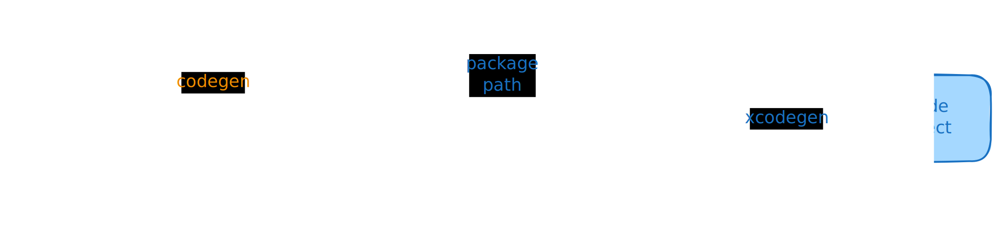

# iOS

When we use Crux to build iOS apps, the Core API bindings are generated in Swift
(with C headers) using Mozilla's [Uniffi](https://mozilla.github.io/uniffi-rs/).

The shared core (that contains our app's behavior) is compiled to a static
library and linked into the iOS binary. To do this we use
[`cargo-xcode`](https://crates.io/crates/cargo-xcode) to generate an Xcode
project for the shared core, which we can include as a sub-project in our iOS
app.

The shared types are generated by Crux as a Swift package, which we can add to
our iOS project as a dependency. The Swift code to serialize and deserialize
these types across the boundary is also generated by Crux as Swift packages.

This section has two guides for building iOS apps with Crux:

1. [Swift and SwiftUI (XcodeGen)](./with_xcodegen.md)
1. [Swift and SwiftUI (manual)](./manual.md)

We recommend the first option, as it's definitely the simplest way to get
started.
