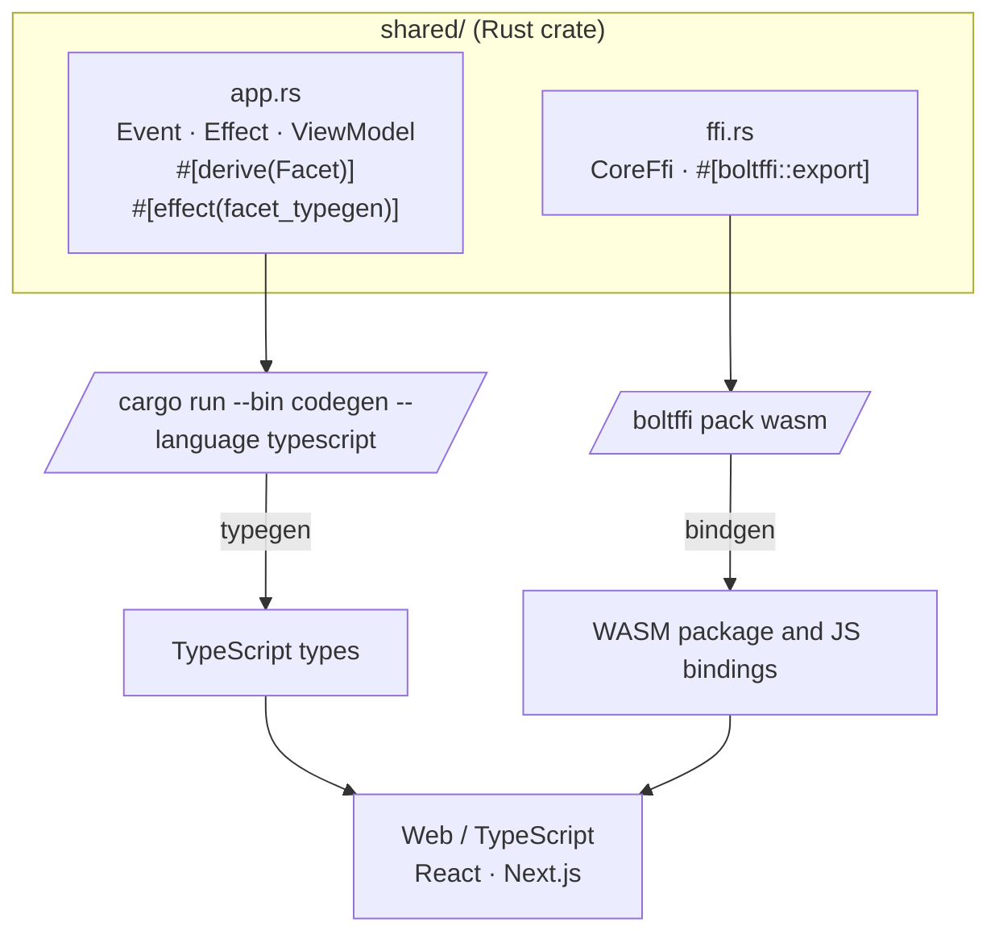

# Web — TypeScript and React (Next.js)

These are the steps to set up and run a simple
TypeScript Web app that calls into a shared core.

```admonish
This walk-through assumes you have already set up the
`shared` library and codegen as described in
[Shared core and types](../../shell.md).
```

```admonish info
There are many frameworks available for writing Web
applications with JavaScript/TypeScript. We've chosen
[React](https://reactjs.org/) with
[Next.js](https://nextjs.org/) for this walk-through
because it is simple and popular. However, a similar
setup would work for other frameworks.
```



## Create a Next.js App

For this walk-through, we'll use the
[`pnpm`](https://pnpm.io/) package manager for no
reason other than we like it the most!

Let's create a simple Next.js app for TypeScript,
using `pnpx` (from `pnpm`). Run this from the root of
the repo, next to `shared`, and call the app
`web-nextjs`, because that's the directory
`shared/boltffi.toml` writes the Wasm package into.

```sh
pnpx create-next-app@latest web-nextjs --app --src-dir --yes
cd web-nextjs
```

The `--app` and `--src-dir` flags pick the App Router
and put the code in a `src/` directory, which is where
the files below go. `--yes` accepts the defaults for
everything else.

## Compile our Rust shared library

When we build our app, we also want to compile the
Rust core to WebAssembly so that it can be referenced
from our code.

To do this, we'll use BoltFFI, which you can install like this:

```sh
cargo install boltffi_cli --version '=0.30.1' --locked
brew install binaryen # provides wasm-opt
```

The crate is `boltffi_cli`; it installs the `boltffi` binary used below.

Binaryen must be version 123 or newer — BoltFFI passes `--enable-bulk-memory-opt`
to `wasm-opt`, which older releases don't understand. Check with
`wasm-opt --version`; distribution packages are often well behind, so prefer a
[release from GitHub](https://github.com/WebAssembly/binaryen/releases) if your
package manager ships something older.

Now that we have `boltffi` installed, we can build
our `shared` library to WebAssembly for the browser.
BoltFFI runs from the `shared` directory, and writes
the package to `web-nextjs/generated/pkg`:

```sh
cd ../shared
boltffi pack wasm
cd ../web-nextjs
```

The generated `package.json` doesn't list the
`shared_node.*` files among the files it publishes,
but its Node.js entry point needs them, and Next.js
uses that entry point when it renders on the server.
Add them with this (the example's `Justfile` does the
same after every `boltffi pack wasm`):

```sh
node -e "const fs = require('node:fs'); const path = 'generated/pkg/package.json'; const pkg = JSON.parse(fs.readFileSync(path, 'utf8')); const files = new Set(pkg.files ?? []); for (const file of ['shared_node.js', 'shared_node.d.ts', 'shared_node.js.map']) files.add(file); pkg.files = [...files]; fs.writeFileSync(path, JSON.stringify(pkg, null, 2) + '\n');"
```

## Generate the Shared Types

To generate the shared types for TypeScript, we use the
codegen CLI we [prepared earlier](../../shell.md). Run
it from the `web-nextjs` directory, so the types land
in `web-nextjs/generated/types`:

```sh
cargo run --package shared --bin codegen \
    --features codegen,facet_typegen \
    -- --language typescript \
       --output-dir generated/types
```

Now add both the Wasm package and the generated types
to the `dependencies` in `package.json`, as local
dependencies:

```json
{
  "dependencies": {
    "shared": "file:generated/pkg",
    "shared_types": "file:generated/types"
  }
}
```

Install the dependencies:

```sh
pnpm install
```

The generated types package (it's called `app`) is
published as TypeScript source, so Next.js needs to
compile it. Tell it to in `next.config.ts`:

```typescript
import type { NextConfig } from "next";

const nextConfig: NextConfig = {
  transpilePackages: ["app"],
};

export default nextConfig;
```

The Wasm package also contains TypeScript sources
alongside its compiled JavaScript, and they don't pass
Next.js's type check. We only use the compiled files,
so add `generated/pkg` to the `exclude` list in
`tsconfig.json`:

```json
{
  "exclude": ["node_modules", "generated/pkg/**/*.ts"]
}
```

## Create some UI

### Counter example

A simple app that increments, decrements and resets a
counter.

#### Wrap the core to handle effects

First, let's add some boilerplate code to wrap our core
and handle the effects that it produces. For this
example, we only need to support the `Render` effect,
which triggers a render of the UI.

```admonish
This code that wraps the core only needs to be written
once — it only grows when we need to support additional
effects.
```

Create `src/app/core.ts` and make it look like the following.
This code sends our (UI-generated) events to the core,
and handles any effects that the core asks for. In this
example, we aren't calling any HTTP APIs or handling
any side effects other than rendering the UI, so we
just handle this render effect by updating the
component's `view` hook with the core's ViewModel.

Notice that we have to serialize and deserialize the
data that we pass between the core and the shell. This
is because the core is running in a separate WebAssembly
instance, and so we can't just pass the data directly.

```typescript
{{#include ../../../../../examples/counter/web-nextjs/src/app/core.ts}}
```

```admonish note title="Why write this by hand?"
The codegen also generates a ready-made `Core` class in `shared_types/app`,
which runs this loop for you. We write the loop by hand in this chapter on
purpose, because it shows how the shell and the core talk to each other. That's
also why ours is called `CoreWrapper`, so it doesn't get mixed up with the
generated `Core`. We pick up the generated `Core` in
[Part II](../../../part-2/shell.md#who-drives-the-loop).
```

```admonish tip
That `matchEffect` call, above, is where you would
handle any other effects that your core might ask for.
For example, if your core needs to make an HTTP
request, you would handle that here. To see an example
of this, take a look at the
[counter-http example](https://github.com/redbadger/crux/tree/master/examples/counter-http/web-nextjs/src/app/core.ts)
in the Crux repository.
```

#### Create a component to render the UI

Edit `src/app/page.tsx` to look like the following.
This code loads the WebAssembly core and sends it an
initial event. Notice that we pass the `setState` hook
to the update function so that we can update the state
in response to a render effect from the core.

```typescript
{{#include ../../../../../examples/counter/web-nextjs/src/app/page.tsx}}
```

Now all we need is some CSS. First add the `Bulma`
package, and then import it in `layout.tsx`.

```bash
pnpm add bulma
```

```typescript
{{#include ../../../../../examples/counter/web-nextjs/src/app/layout.tsx}}
```

## Build and serve our app

We can build our app, and serve it for the browser,
in one simple step.

```sh
pnpm dev
```

```admonish success
Your app should look like this:

<p align="center"></p>
```
