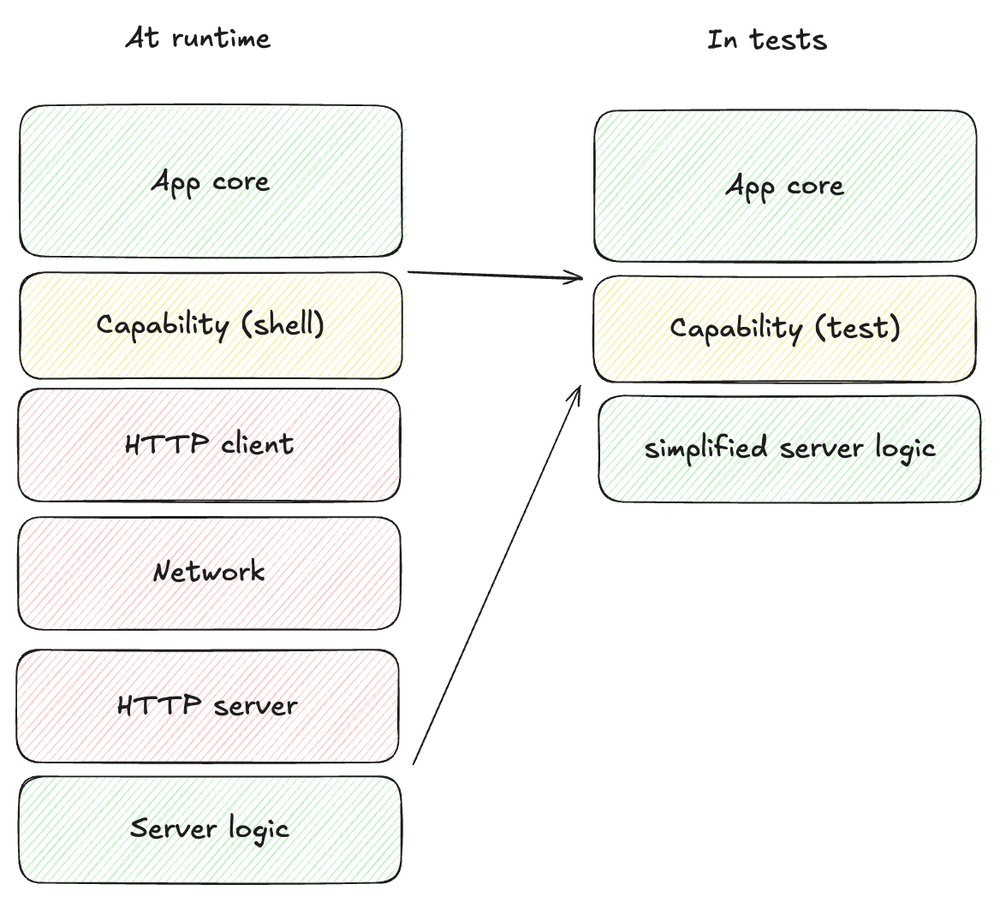

# Testing with managed effects

We have seen how to use effects, and we have seen a little bit about the testing,
but we should look at that closer.

Crux was expressly designed to support easy, fast, comprehensive testing of your
application. Everyone is generally on board with unit tests and TDD when it comes
to basic pure logic. But as soon as any I/O or UI gets involved, the dread sets in.
We're going to have to set up some fakes, introduce additional traits _just_ to test
things, or just bite the bullet and build tests around a fully integrated app and
wait for them to run (and probably fail on a race condition sometimes). So most people give up.

Managed effects smooth over that big hump. You pay for it a little bit in how the
code is written, but you reap the reward in testing it. This is because the core
that uses managed effects is pure and therefore completely deterministic —
all the side effects are pushed to the shell.

It's straightforward to write an exhaustive set of unit tests that give you
complete confidence in the correctness of your application code — you can test
the behavior of your application independently of platform-specific UI and API
calls.

There is no need to mock/stub anything, and there is no need to write
integration tests.

Not only are the unit tests easy to write, but they run extremely quickly, and
can be run in parallel.

For example, here's a test checking that when the weather screen is shown,
a location gets checked and the weather gets refreshed.

```rust
{{#include ../../../examples/weather/shared/src/weather/events.rs:test}}
```

You can see it's a test of a whole interaction with multiple kinds of effects,
and it runs in 11 ms and is entirely deterministic.

Here's the corresponding code it's testing:

```rust
{{#include ../../../examples/weather/shared/src/weather/events.rs:code}}
```

Hopefully this illustrates that the managed effects let you test entire transactions
involving effects, without ever executing any.

The full suite of 18 tests of the Weather app runs in 49 milliseconds. In practice,
it's rare for a test suite of a Crux app to take longer than compiling it (even incrementally).
Even apps with thousands of tests usually run them in seconds, and sadly they do not yet compile
in seconds.

```txt
cargo nextest run
   Compiling shared v0.1.0 (/Users/viktor/Projects/crux/examples/weather/shared)
    Finished `test` profile [unoptimized + debuginfo] target(s) in 1.11s
────────────
 Nextest run ID 4f51de83-8f2e-4acf-b75f-03969767e886 with nextest profile: default
    Starting 18 tests across 1 binary
        PASS [   0.020s] shared app::tests::test_navigation
        PASS [   0.020s] shared favorites::events::tests::test_add_multiple_favorites
        PASS [   0.019s] shared favorites::events::tests::test_delete_confirmed
        PASS [   0.020s] shared favorites::events::tests::test_cancel_returns_to_favorites
        PASS [   0.019s] shared favorites::events::tests::test_kv_set_and_load
        PASS [   0.023s] shared favorites::events::tests::test_delete_cancelled
        PASS [   0.023s] shared favorites::events::tests::test_delete_pressed
        PASS [   0.022s] shared favorites::events::tests::test_delete_with_persistence
        PASS [   0.022s] shared favorites::events::tests::test_kv_load_empty
        PASS [   0.013s] shared favorites::events::tests::test_kv_load_error
        PASS [   0.011s] shared favorites::events::tests::test_submit_duplicate_favorite
        PASS [   0.012s] shared favorites::events::tests::test_submit_adds_favorite
        PASS [   0.013s] shared favorites::events::tests::test_submit_persists_favorite
        PASS [   0.011s] shared weather::events::tests::test_fetch_favorites_triggers_fetch_for_all_favorites
        PASS [   0.011s] shared weather::events::tests::test_show_triggers_set_weather
        PASS [   0.012s] shared weather::events::tests::test_fetch_triggers_favorites_fetch_when_favorites_exist
        PASS [   0.027s] shared weather::events::tests::test_current_weather_fetch
        PASS [   0.027s] shared favorites::events::tests::test_search_triggers_api_call
────────────
     Summary [   0.049s] 18 tests run: 18 passed, 0 skipped
```

## The test steps

Crux provides a test APIs to make the tests a bit more readable and nicer to write,
but it's still up to the test to execute the app loop.

Let's have a look at a simpler test from the Weather app and go through it step by step:

```Rust
{{#include ../../../examples/weather/shared/src/favorites/events.rs:test}}
```

First, we do some setup - create a model, create a favorite and insert it, and
make sure the app is in the right Workflow state.

Then, we call update with `FavoritesEvent::DeleteConfirmed` and get back a command, which we
store in `cmd`.

The next line is our assertion on the command - we expect an effect, and we expect it to be
a key value effect. The expectation either returns the KeyValueRequest or panics.

Then we inspect the request's operation to check it's a `Set` – for the purposes of this test
that's enough.

We can then check the favourites in the model are gone, and there is nothing else to do.

## More integrated tests and deterministic simulation testing

We could test the key-value storage in a more integrated fashion too - instead of asserting
on the key value operation, we can provide a very basic implementation of a key value store
to use in tests, using a `HashMap` as storage for example. Then we could simply forward the
key-value effects to it and make sure the storage is managed correctly. Similarly, we could
build a predictable replica of an API service we need to test against, etc.

While that's all starting to sounds a lot like mocking, remember that we're not implementing
Redis or building an actual HTTP server. It's all very simple code. And if we do that for all
the different effects our app needs and provide a realistic _enough_ implementations to mimic
the real things, a very interesting thing happens - we get the entire app stack, with the
nitty gritty technical details taken out, running in a unit test.



With that, we can create an app instance and send it completely random (but deterministic)
events, and make sure "nothing bad happens". The definition of what that means is specific
to each app, but just to illustrate some options:

- Introduce randomised errors to your fake API and see they are handled correctly
- Randomly lose data in storage and make sure the app recovers
- Make sure timeouts work correctly by randomly firing them first
- Check that any other invariants hold, e.g. anything time-related only moves forward
  (counters count up), storage remains referentially consistent, logically impossible states
  do not happen (ideally they would be impossible to represent, but sometimes that's too hard)

When we do that, we can then run this pseudo random process, for hours if we like, and let it
find any bugs for us. To reproduce them, all we need is the random seed used for the specific
test run.

In practice, Crux apps will mostly be able to run at thousands of events a second, and these
tests will explore more of the state space than we ever could with manual unit tests.

This type of testing is usually reserved to consensus algorithms and network protocols (where
anything that can happen _will_ happen and they have to be rock solid), because setting up the
test harness is just too much work. But with managed effects it is a few hundred lines of
additional code. For a modestly sized app, a testing harness like that will only take a few
days to write. We may even ship building blocks of such test harness with Crux in the future.
