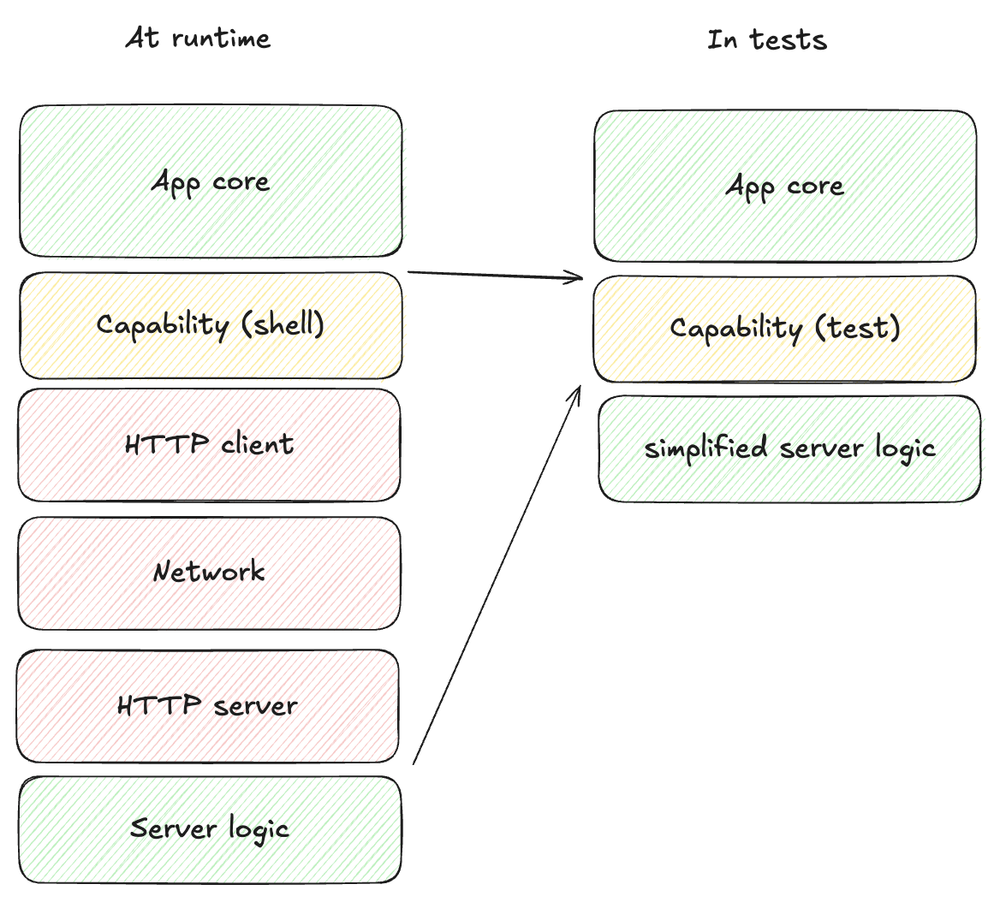

# Testing with managed effects

We have seen how to use effects, and we have seen a little bit about the testing,
but we should look at that closer.

Crux was expressly designed to support easy, fast, comprehensive testing of your
application. Everyone is generally on board with unit tests and TDD when it comes
to basic pure logic. But as soon as any I/O or UI gets involved, the dread sets in.
We're going to have to set up some fakes, introduce additional traits _just_ to test
things, or just bite the bullet and build tests around a fully integrated app and
wait for them to run (and probably fail on a race condition sometimes). So most people give up.

Managed effects smooth over that big hump. You pay for it a little bit in how the
code is written, but you reap the reward in testing it. This is because the core
that uses managed effects is pure and therefore completely deterministic —
all the side effects are pushed to the shell.

It's straightforward to write an exhaustive set of unit tests that give you
complete confidence in the correctness of your application code — you can test
the behavior of your application independently of platform-specific UI and API
calls.

There is no need to mock/stub anything, and there is no need to write
integration tests.

Not only are the unit tests easy to write, but they run extremely quickly, and
can be run in parallel.

For example, here's a test that drives `LocalWeather` through a full weather fetch — checking location permission, resolving the location, then handling the weather response. A setup helper advances the state machine through the first two events by resolving each effect with a canned response:

```rust
{{#include ../../../examples/weather/shared/src/model/active/home/local.rs:drive_helper}}
```

The test itself picks up from `FetchingWeather`, resolves the HTTP effect, and asserts that the final state is `Fetched` with the expected data:

```rust
{{#include ../../../examples/weather/shared/src/model/active/home/local.rs:full_test}}
```

It's a test of a whole interaction with multiple kinds of effects — location services and HTTP — and it runs in a couple of milliseconds, entirely deterministic. The code being tested is `LocalWeather::update` from chapter 4; managed effects let us verify the whole transaction without executing any of it.

The full suite of 57 tests of the Weather app runs in around 20 milliseconds on a Mac Mini M4 Pro. In practice, it's rare for a test suite of a Crux app to take longer than compiling it (even incrementally). Apps with thousands of tests usually run them in seconds, though compilation takes longer.

```txt
cargo nextest run
    Finished `test` profile [unoptimized + debuginfo] target(s) in 0.28s
────────────
    Starting 57 tests across 1 binary
    ...
     Summary [   0.020s] 57 tests run: 57 passed, 0 skipped
```

## The test steps

Crux provides test APIs to make the tests a bit more readable, but it's still up to the test to drive the event → update → effect → resolve cycle by hand.

Let's walk through a simpler test from the Weather app step by step:

```rust
{{#include ../../../examples/weather/shared/src/model/active/home/local.rs:simple_test}}
```

First, we build a fresh `LocalWeather::default()` — its starting state is `CheckingPermission`.

We then call `update` with `LocationEnabled(true)`, as if the shell had just reported that location services are available. `update` returns an `Outcome`, which we destructure with `.expect_continue().into_parts()` — we know this event doesn't complete the state machine, so we assert on `Continue` and get back the updated state plus any command.

We assert the new state is `FetchingLocation`. Then we ask the command for its single effect via `.expect_one_effect()`, narrow it to a location effect with `.expect_location()`, and check the operation is `GetLocation`.

That's the whole test. `update` is a pure function, so there's nothing to set up beyond the initial state and nothing to tear down.

## More integrated tests and deterministic simulation testing

We could test the key-value storage in a more integrated fashion too - instead of asserting
on the key value operation, we can provide a very basic implementation of a key value store
to use in tests, using a `HashMap` as storage for example. Then we could simply forward the
key-value effects to it and make sure the storage is managed correctly. Similarly, we could
build a predictable replica of an API service we need to test against, etc.

While that's all starting to sound a lot like mocking, remember that we're not implementing
Redis or building an actual HTTP server. It's all very simple code. And if we do that for all
the different effects our app needs and provide a realistic _enough_ implementation to mimic
the real things, a very interesting thing happens - we get the entire app stack, with the
nitty gritty technical details taken out, running in a unit test.



With that, we can create an app instance and send it completely random (but deterministic)
events, and make sure "nothing bad happens". The definition of what that means is specific
to each app, but just to illustrate some options:

- Introduce randomised errors to your fake API and see they are handled correctly
- Randomly lose data in storage and make sure the app recovers
- Make sure timeouts work correctly by randomly firing them first
- Check that any other invariants hold, e.g. anything time-related only moves forward
  (counters count up), storage remains referentially consistent, logically impossible states
  do not happen (ideally they would be impossible to represent, but sometimes that's too hard)

When we do that, we can then run this pseudo random process, for hours if we like, and let it
find any bugs for us. To reproduce them, all we need is the random seed used for the specific
test run.

In practice, Crux apps will mostly be able to run at thousands of events a second, and these
tests will explore more of the state space than we ever could with manual unit tests.

This type of testing is usually reserved to consensus algorithms and network protocols (where
anything that can happen _will_ happen and they have to be rock solid), because setting up the
test harness is just too much work. But with managed effects it is a few hundred lines of
additional code. For a modestly sized app, a testing harness like that will only take a few
days to write. We may even ship building blocks of such test harness with Crux in the future.
