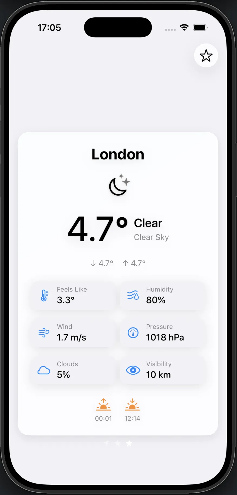
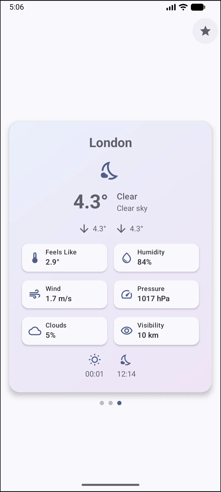
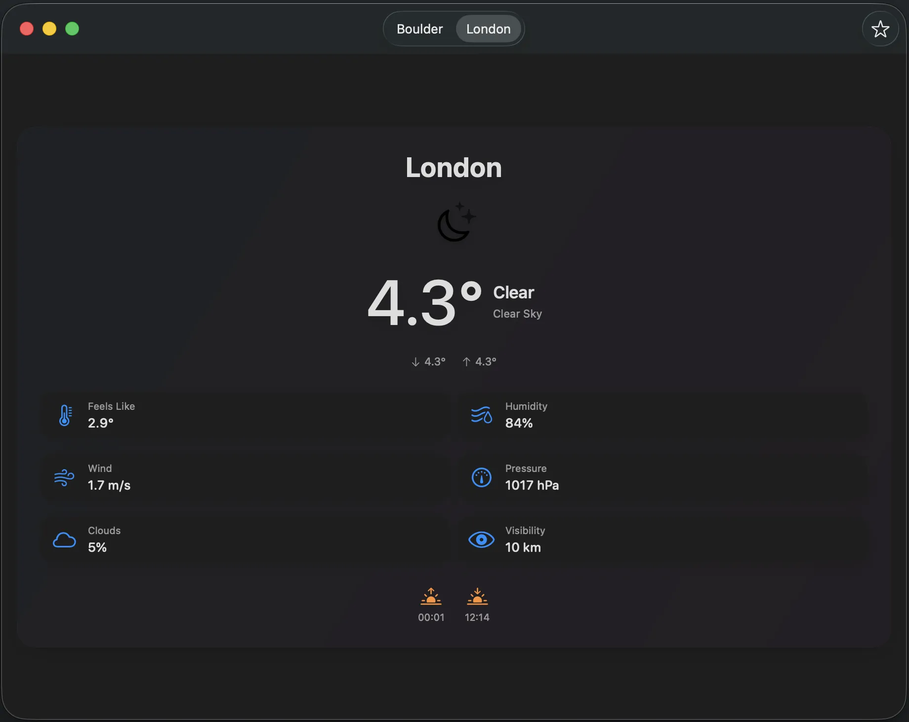
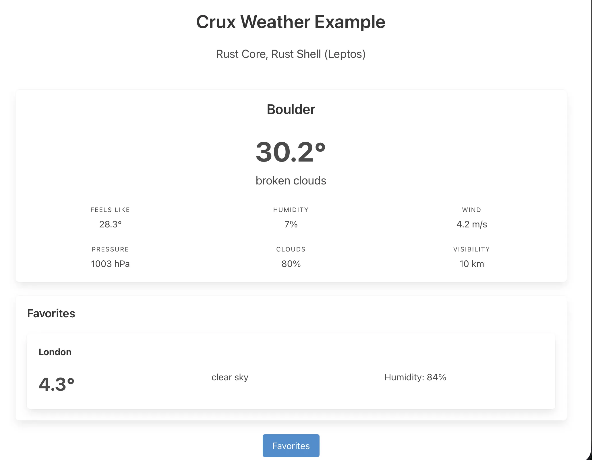
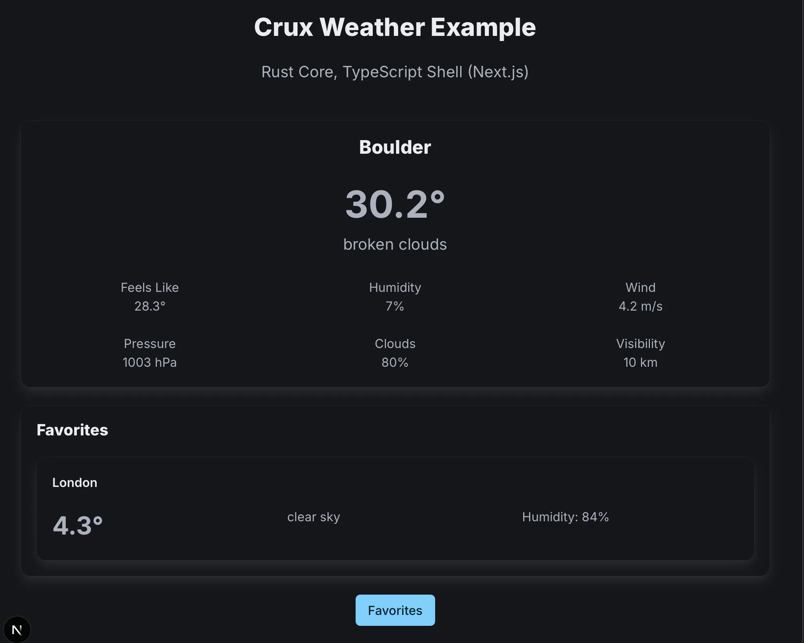

# The Weather App

So far, we've explained the basics on a very simple counter app. So simple in fact, that
it barely demonstrated any of the key features of Crux.

Time to ditch the training wheels and dive into something real. We'll need to demonstrate
a few key concepts. How the Elm architecture works at a larger scale, how we manage
navigation in a multi-screen app, and the main focus will be on managed effects and capabilities.
To that end, we'll need an app that does enough interesting things, while staying reasonably small.

So we're going to build a Weather app. It needs to call an API,
store data and secrets locally, and use location APIs to show local weather. That's plenty of effects
for us to play with and see how Crux supports this.

Here's the same app — one shared core — running on iOS, Android, macOS, and the web:

  <figure style="text-align: center; margin: 0;">
    
    <figcaption><small>iOS (SwiftUI)</small></figcaption>
  </figure>
  <figure style="text-align: center; margin: 0;">
    
    <figcaption><small>Android (Jetpack Compose)</small></figcaption>
  </figure>

  <figure style="text-align: center; margin: 0;">
    
    <figcaption><small>macOS (SwiftUI)</small></figcaption>
  </figure>

  <figure style="text-align: center; margin: 0;">
    
    <figcaption><small>Web — Leptos (Rust)</small></figcaption>
  </figure>
  <figure style="text-align: center; margin: 0;">
    
    <figcaption><small>Web — Next.js (TypeScript)</small></figcaption>
  </figure>

The app works like a system weather utility: you get your local weather,
search for locations, and save favourites — all backed by a real API.

You can look at the [full example code](https://github.com/redbadger/crux/tree/master/examples/weather)
in the Crux Github repo, but we'll walk through the key parts. As before, we're going to start with the core
and once we have it, look at the shells.

Unlike Part I, we'll work by concept rather than by commit: lifecycle states, nested state machines, effects, testing, capabilities, and shells — each with the Weather app as the worked example.

Before we dive in though, lets quickly establish some foundations about the app architecture Crux follows,
known most widely as the Elm architecture, based on the language which popularised it.
