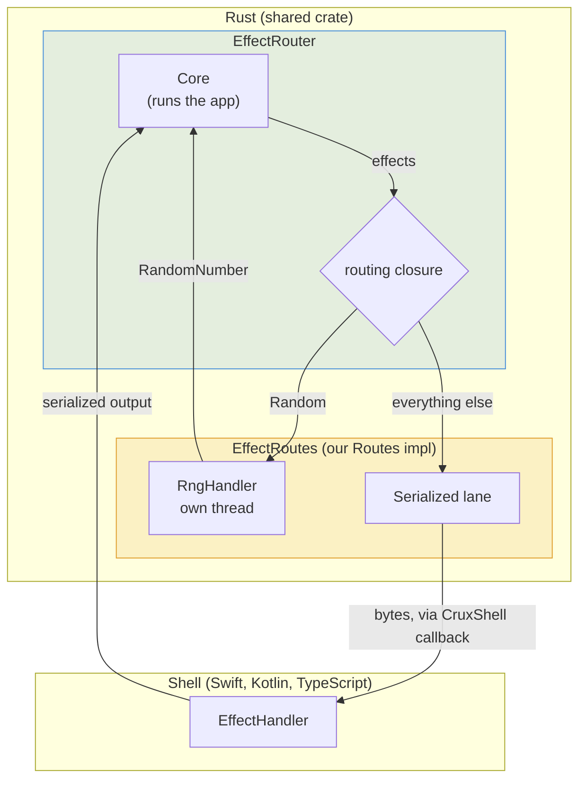

# Effect router

Most Crux apps handle every effect in the shell. The core serializes each
request, the shell performs it with the platform's own APIs, and the shell
sends the serialized output back. For most effects, that's exactly what you
want, and it's how everything else in this book works.

Sometimes an effect is better handled in Rust, next to the core. You may want
to use an existing Rust library that isn't written in a sans-I/O way, so it
can't be driven from the app's `update`. The request or its result may be
awkward or impossible to serialize, like a pointer-style handle to a rendering
surface or a large buffer. Or the work may simply be better written once, in
Rust, than separately in each shell.

The effect router handles these cases. An `EffectRouter` wraps the `Core` and
a routing closure you write. The closure looks at each effect the app emits
and sends it to a handler, or "lane". An effect can go to:

- the shell, over the usual serialized interface,
- a custom FFI of your own, or
- Rust code running alongside the core.

The app itself doesn't change. It requests effects as usual, and doesn't know
which lane handles them.

We'll walk through the
[counter-routing](https://github.com/redbadger/crux/tree/master/examples/counter-routing)
example: an HTTP counter with a "random" button, which changes the count by a
random amount. (The [middleware](./middleware.md) chapter builds the same app
with middleware instead.) Here the random number comes from a core-side handler that the router
sends `Random` effects to.

## The operation and the app

The random number is an ordinary operation, declared with
`#[derive(Operation)]` as a request that produces a `RandomNumber`:

```rust,no_run,noplayground
// Rust
{{#include ../../../examples/counter-routing/shared/src/capabilities/mod.rs:operation}}
```

The app adds it to its `Effect` enum as a `Random` variant:

```rust,no_run,noplayground
// Rust
{{#include ../../../examples/counter-routing/shared/src/app.rs:effect}}
```

And it asks for a random number with `Command::request_from_shell`, as it
would for any effect:

```rust,no_run,noplayground
// Rust
            Event::Random => Command::request_from_shell(RandomNumberRequest(-5, 5))
                .map(|out| out.0)
                .then_send(Event::UpdateBy),
```

Nothing in the app mentions routing. Where `Random` is handled is decided in
the FFI module, which is the user-owned assembly point between the core and
the shell.

## Routing effects

Here is the whole flow in the counter. The core runs the app and hands every
effect it emits to the routing closure. The closure sends `Random` to the
`RngHandler` and everything else to the shell. Whichever lane answers, the
answer goes back to the core, and any follow-up effects come round through
the closure again.



### The routes

The handlers an `EffectRouter` dispatches to are grouped in a type of your
own, which implements the `Routes` trait. The counter has two: the
`Serialized` lane, which talks to the shell, and the `RngHandler`, which
produces random numbers in Rust.

```rust,no_run,noplayground
// Rust
{{#include ../../../examples/counter-routing/shared/src/ffi.rs:routes}}
```

`Routes::new` receives a `Weak` reference to the router that will own the
routes. Each route keeps it so that, when it resolves a request later, it can
move the core's effect runtime forward. The reference is weak because the
router owns the routes, and a strong reference back would be a cycle. For the
same reason the router is always held in an `Arc`. The type must be `Clone`,
because the routing closure gets a copy of it, so each route is wrapped in an
`Arc` and cloning shares the same handlers.

### The routing closure

`EffectRouter::new` takes the `Core` and a builder closure. The router first
constructs the routes, then passes them to the builder, which returns the
routing closure. That way the routing closure can capture the routes it
dispatches to. Here is the whole of `CoreFfi::new`:

```rust,no_run,noplayground
// Rust
{{#include ../../../examples/counter-routing/shared/src/ffi.rs:ffi_new}}
```

On native targets the routing closure has two arms. A `Random` request goes
to the `RngHandler`. Every other effect is converted to the FFI's own `Effect`
type, serialized by the `Serialized` lane, and handed to the shell through
the `CruxShell` callback. The fall-through arm is the usual place for the
`Serialized` lane: the router is an opt-in for the few effects that need
special handling, and everything else keeps working as it would with a plain
bridge.

The routing closure isn't only called for the effects that `update` returns.
When any lane resolves a request, the router collects the follow-up effects
the app produces and passes each of them through the same closure. When the
`RngHandler` answers a `Random`, the command that asked for the number turns
the answer into an `UpdateBy` event for the app (that's what
`.then_send(Event::UpdateBy)` does). The `Render` and HTTP requests that
`UpdateBy` produces are then routed exactly as they would be if the shell had
answered. So one policy applies to the whole chain of
effects, however it was started.

On WebAssembly there are no threads for the `RngHandler` to use, so the
`wasm` branch doesn't use the router at all. It bridges the `Core` directly,
`Random` reaches the shell like any other effect, and the JavaScript shell
answers it.

### The lanes

`crux_core::effects::routes` has three lanes:

- `Serialized` keeps the standard bridge behaviour. Each effect is registered
  under an `EffectId` and serialized to bytes with the FFI format (here
  `BincodeFfiFormat`) by `Serialized::serialize`. The shell later calls
  `Serialized::resolve` with the id and the serialized output. It also
  provides `update` and `view` over bytes, so it covers the whole serialized
  FFI surface.
- `Parked` is for effects the shell handles over a custom FFI that you design,
  because the payload or the output shouldn't be serialized. The routing
  closure calls `Parked::park` with the request, which stores it and returns a
  `ParkedEffectId` together with the typed operation. Your FFI passes both to
  the shell however it likes. When the shell has the output, your FFI calls
  `Parked::resolve` with the id and the typed output, and the router routes the
  follow-up effects as usual. `ParkedEffectId::into_raw` and
  `ParkedEffectId::from_raw` turn the id into a `u64` and back, for crossing
  the FFI. The counter doesn't need this lane. The crate's
  [`effect_router_prototype`](https://github.com/redbadger/crux/blob/master/crux_core/tests/effect_router_prototype.rs)
  test uses it for a camera effect that returns an opaque image reference.
- `Buffer` collects requests with `Buffer::push`, for the surrounding code to
  take with `Buffer::drain` and handle synchronously. It does no FFI or id
  bookkeeping, which makes it convenient in tests and for simple in-process
  handlers.

A core-side handler like the `RngHandler` isn't one of these types. It is any
Rust code that holds the requests it is given and resolves them back through
the router, as the next section shows.

### The FFI effect type

The `Serialized` lane needs an effect type it can serialize, and only the
effects that reach it need to be in it. So the FFI module declares its own
`Effect` enum without the `Random` variant, and converts from the app's:

```rust,no_run,noplayground
// Rust
{{#include ../../../examples/counter-routing/shared/src/ffi.rs:ffi_effect}}
```

The `From` implementation panics on `Random`, because the routing closure
handles that variant before it converts anything. `#[effect(facet_typegen)]`
generates the `EffectFFI` implementation that `Serialized::serialize` needs.

Type generation doesn't see this enum. The codegen binary registers the app,
so the shells' generated `EffectHandler` follows the app's `Effect` and still
has a `random` method. The Swift and Kotlin shells implement it by failing
with an error, because on their targets the router answers `Random` and the
method is never called.

```admonish note title="A known rough edge"
We plan to have type generation follow the effects that actually reach the
shell, so a shell is never asked to implement a method for an effect the
router handles. Until then, the native shells need the failing `random`
method. See [#623](https://github.com/redbadger/crux/issues/623).
```

## A core-side handler

The `RngHandler` generates random numbers on a background thread:

```rust,no_run,noplayground
// Rust
{{#include ../../../examples/counter-routing/shared/src/rng_handler.rs}}
```

The routing closure calls `RngHandler::process` with the `Request`, which
sends it to a persistent worker thread over a channel. The thread owns the
random number generator, so its seed lives in one place. When it has a
number, it resolves the request through the `ResolveSink` trait, which the
`EffectRouter` implements. `ResolveSink::resolve_request` resolves the request
and then moves the core's effect runtime forward, routing every follow-up
effect through the routing closure. That is how the `Render` and HTTP requests
that follow a random number reach the shell, on the `RngHandler`'s thread.

`RngHandler::new` takes a `Weak` reference to anything that implements
`ResolveSink<RandomNumberRequest>`, rather than the router itself. The
handler depends only on the one operation it serves, not on the app or the
route set, and the `Weak` it is given in `Routes::new` is exactly that. If the
router has been dropped, the upgrade fails and the handler drops the request.

The `process` call returns straight away, which matters: the routing closure
runs inside `update` and `resolve`, so a handler that blocked there would
block the shell's call into the core.

## The FFI surface

On native targets, every effect the router sends to the shell goes through
one callback, the `CruxShell` trait that the shell implements and passes to
`CoreFfi::new`:

```rust,no_run,noplayground
// Rust
{{#include ../../../examples/counter-routing/shared/src/ffi.rs:crux_shell}}
```

The bytes are a serialized vector of requests, the same shape that a plain
bridge's `update` and `resolve` return, so the shell handles them the same
way. Each call carries the request for one effect.

This includes the effects produced synchronously inside `update` and
`resolve`. The router calls the routing closure for each of them before the
call returns, and the closure calls `process_effects` straight away. So on
native targets `update` and `resolve` always return an empty vector:

```rust,no_run,noplayground
// Rust
{{#include ../../../examples/counter-routing/shared/src/ffi.rs:ffi_update}}
```

The callback, then, arrives in two ways. Most calls come on the thread that
called `update` or `resolve`, before that call has returned. The rest come
from the `RngHandler`'s thread, after it has answered a `Random`. The shells
have to handle both, which is what the next section is about.

A `Parked` lane adds to this surface rather than replacing it. You would add a
callback to the shell trait for the parked effect, carrying its id and
operation, and a method on `CoreFfi` that the shell calls to resolve it. Both
are yours to design, with whatever types your binding generator can carry.

## In the shell

The counter-routing shells use the generated `Core`
([Who drives the loop](../part-2/shell.md#who-drives-the-loop)), with an
`EffectHandler` that delegates `http` to the handler `crux_http` ships and
implements `serverSentEvents` by hand. `CoreFfi::new` takes the shell's
callback, but the generated `FfiBridge` constructs `CoreFfi` with no
arguments, so the codegen binary doesn't configure `.boltffi(...)`. Instead
each shell writes the three-method `CoreBridge` over its own `CoreFfi`, and
constructs the generated `Core` with it. See
[the generated Core](../part-4/typegen.md#the-generated-core) for
`CoreBridge` and `Core(bridge:handler:)` in each language.

### Swift

The Swift bridge takes the callback and hands it to `CoreFfi`. Its methods are
bytes in, bytes out:

```swift
// Swift: apple/CounterApp/RoutingBridge.swift
{{#include ../../../examples/counter-routing/apple/CounterApp/RoutingBridge.swift:bridge}}
```

The callback has to hand its bytes to the `Core`'s `process(bytes:)`, but
construction runs the other way: the `Core` is built from the bridge, which
is built from the callback. The callback breaks the cycle by not holding the
`Core` at all. It puts each batch on an `AsyncStream`, in the order the batches
arrive:

```swift
// Swift: apple/CounterApp/RoutingBridge.swift
{{#include ../../../examples/counter-routing/apple/CounterApp/RoutingBridge.swift:callback}}
```

Once the `Core` exists, one task on the main actor reads the stream and
passes each batch on. The Swift `Core` is `@MainActor`, so the batches have to
be processed there, whichever thread they arrived on. Because one task reads
the whole stream, the batches reach the `Core` in the order the router sent
them. And because the task runs later, a batch sent from inside `update` is
never processed while `update` is still running:

```swift
// Swift: apple/CounterApp/RoutingBridge.swift
{{#include ../../../examples/counter-routing/apple/CounterApp/RoutingBridge.swift:make_core}}
```

The app builds its `Core` with `makeCore()` in place of `Core(handler:)`, and
the rest of the shell is the same as any other.

### Kotlin

The Kotlin shell has the same `RoutingBridge` over `CoreFfi`, and a
`RoutedEffects` callback whose `core` property is set once the `Core` has been
constructed. Nothing calls the callback before then, because the router only
has effects once an event has been sent.

The callback posts each batch to the main thread with `Dispatchers.Main`, not
`Dispatchers.Main.immediate`. The Kotlin `Core` isn't thread-safe, so the batch
has to run on the main thread. But most batches arrive on the main thread,
inside the `CoreFfi` call that produced them, and `Main.immediate` would run
them inline, calling back into `CoreFfi` before that call has returned.
`Dispatchers.Main` always posts, and the main looper runs posts in order, so
the batches reach the `Core` in the order the router sent them.

### Web

In WebAssembly `CoreFfi` bridges the `Core` directly, without the router, so
`Random` reaches the shell. The TypeScript `CounterHandler` implements
`random` with `Math.random`, and its `RoutingBridge` passes a callback that
forwards bytes to the `Core`'s `processBytes`, through a variable that is
assigned once the `Core` has been built. In WebAssembly that callback is never
called, because `update` and `resolve` return every effect themselves. The Leptos shell is written in Rust,
uses the `Core` directly without the FFI, and answers `Random` itself.

## Testing

The router lives in the FFI module, so it isn't involved in testing the app.
You test `update` directly, treating `Random` as a normal effect and resolving
it yourself:

```rust,no_run,noplayground
// Rust
{{#include ../../../examples/counter-routing/shared/src/app.rs:random_test}}
```

The app's logic stays pure and testable, and how its effects are handled is a
separate concern, composed at the FFI boundary.

## Summary

To route some effects to handlers of your own:

1. **Define the operation** with `#[derive(Operation)]`, and request it from
   the app as usual.
2. **Group the routes** in a type that implements `Routes`, with a
   `Serialized` lane for the shell and a lane or handler for each effect that
   needs special handling.
3. **Write the routing closure** in `EffectRouter::new`, sending each effect to
   its lane, with `Serialized` as the fall-through arm.
4. **Deliver the shell's effects through the callback**, and have each shell
   write a `CoreBridge` that constructs `CoreFfi` with it.

For the full API reference, see the
[`effects` module docs](https://docs.rs/crux_core/latest/crux_core/effects/index.html).
The [Effect Router RFC](../rfcs/effect-router.md) explains the motivation
and the design.
