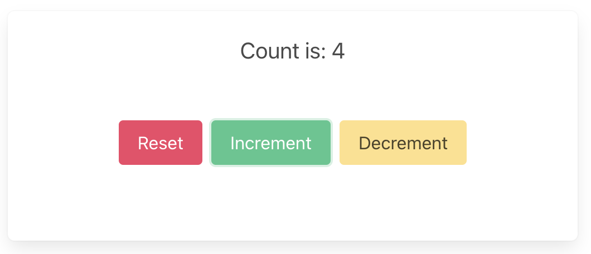

# Web: TypeScript and React Router

These are the steps to set up and run a simple TypeScript Web app that calls
into a shared core.

```admonish
This walk-through assumes you have already set up the `shared` library and codegen as described in [Getting started](../../getting_started/core.md).
```

```admonish info
There are many frameworks available for writing Web applications with JavaScript/TypeScript. We've chosen [React](https://reactjs.org/) with [React Router](https://reactrouter.com/) for this walk-through. However, a similar setup would work for other frameworks.
```

## Create a React Router App

For this walk-through, we'll use the [`pnpm`](https://pnpm.io/) package manager
for no reason other than we like it the most! You can use `npm` exactly the same
way, though.

Let's create a simple React Router app for TypeScript with `pnpm`. You can give
it a name and then probably accept the defaults.

```sh
pnpm create react-router@latest
```

## Compile our Rust shared library

When we build our app, we also want to compile the Rust core to WebAssembly so
that it can be referenced from our code.

To do this, we'll use BoltFFI, which you can install like this:

```sh
cargo install boltffi_cli --version '=0.30.1' --locked
brew install binaryen # provides wasm-opt
```

The crate is `boltffi_cli`; it installs the `boltffi` binary used below.

Binaryen must be version 123 or newer, because BoltFFI passes `--enable-bulk-memory-opt`
to `wasm-opt`, which older releases don't understand. Check with
`wasm-opt --version`; distribution packages are often well behind, so prefer a
[release from GitHub](https://github.com/WebAssembly/binaryen/releases) if your
package manager ships something older.

Now that we have `boltffi` installed, we can build our core, from its `ffi` crate, to
WebAssembly for the browser.

```sh
(cd ffi && boltffi pack wasm)
```

````admonish tip
  You might want to add a `wasm:build` script to your `package.json` file, and
  call it when you build your React Router project.

  ```json
  {
    "scripts": {
      "build": "pnpm run wasm:build && react-router build",
      "dev": "pnpm run wasm:build && react-router dev",
      "wasm:build": "cd ../ffi && boltffi pack wasm"
    }
  }
  ```
````

Add the `shared` library as a Wasm package to your `web-react-router` project:

```sh
cd web-react-router
pnpm add ./generated/pkg
```

We want Vite to bundle our `shared` Wasm package, so we register the wasm and
React Router plugins in `vite.config.ts`:

```ts
{{#include ../../../../examples/counter/web-react-router/vite.config.ts}}
```

## Add the Shared Types

To generate the shared types for TypeScript, run the `codegen` binary, telling
it which language to emit and where to put the output:

```sh
cargo run --package shared_ffi --bin codegen --features codegen,facet_typegen -- \
    --language typescript --output-dir generated/types
```

You can check that they have been generated correctly:

```sh
ls --tree generated/types
generated/types
├── app.ts          # your app's Event / Effect / ViewModel types
├── app.d.ts
├── bincode
│  ├── bincodeDeserializer.ts
│  ├── bincodeSerializer.ts
│  └── index.ts
├── serde
│  ├── binaryDeserializer.ts
│  ├── binarySerializer.ts
│  ├── deserializer.ts
│  ├── serializer.ts
│  ├── types.ts
│  └── index.ts
├── package.json
└── tsconfig.json
```

You can see that it also generates an `npm` package that we can add directly to
our project.

```sh
pnpm add ./generated/types
```

## Load the Wasm binary when our React Router app starts

The `app/entry.client.tsx` file is where we load our Wasm binary. We import the
`shared` package and wait for its `initialized` promise to resolve before
hydrating the app, so the WASM module is ready before any event reaches the
core.

```ts
{{#include ../../../../examples/counter/web-react-router/app/entry.client.tsx}}
```

## Create some UI

```admonish example
We will use the [simple counter example](https://github.com/redbadger/crux/tree/master/examples/counter), which has a `shared` library and generated TypeScript types that will work with the following example code.
```

### Simple counter example

A simple app that increments, decrements and resets a counter.

#### Write the effect handler

The generated types include a `Core` class that drives the loop between the
shell and the Rust core: it serializes the events we send, passes them to the
core, deserializes the requests that come back and dispatches each one to an
`EffectHandler` that we write. Because the codegen binary was told where
`boltffi pack wasm` puts the bindings (with `.boltffi(..)`, see
[Type generation](../../part-4/typegen.md#bridging-to-boltffi)), it also
generates the `FfiBridge` that carries the bytes to and from `CoreFfi`, so
there is no hand-written wrapper.

Edit `app/core.ts` to look like the following. The generated `EffectHandler`
interface has one method per operation the app declares. The counter's only
effect is `Render`, which the generated `Core` handles itself (it reads the
new view model and passes it to the `onView` callback), so `CounterHandler`
is empty.

`Core.create` is an `async` factory rather than a constructor, because it
waits for the Wasm module's `initialized` promise before it builds the bridge.

```typescript
{{#include ../../../../examples/counter/web-react-router/app/core.ts}}
```

```admonish tip
`CounterHandler` is where you would handle any other effects that your core
might ask for. For example, if your core needs to make an HTTP request, the
generated `EffectHandler` gains a method for that operation, which returns the
response.
To see an example of this, take a look at the
[weather example](https://github.com/redbadger/crux/tree/master/examples/weather/web-nextjs/src/lib/core)
in the Crux repository.
```

#### Create a component to render the UI

Edit `app/routes/_index.tsx` to look like the following. When the component
mounts, we create the core, passing the `setView` state setter as the `onView`
callback, so every `Render` from the core updates the view. The `onView`
callback is only called on a render, so we also set the view once from
`core.view` when the core has been created. The buttons send events to the
core with `update`.

```typescript
{{#include ../../../../examples/counter/web-react-router/app/routes/_index.tsx}}
```

Now all we need is some CSS.

To add a CSS stylesheet, we can add it to the `Links` export in the
`app/root.tsx` file.

```tsx
{{#include ../../../../examples/counter/web-react-router/app/root.tsx:links}}
```

## Build and serve our app

We can build our app, and serve it for the browser, in one simple step.

```sh
pnpm dev
```

```admonish success
Your app should look like this:

<p align="center"></p>
```
