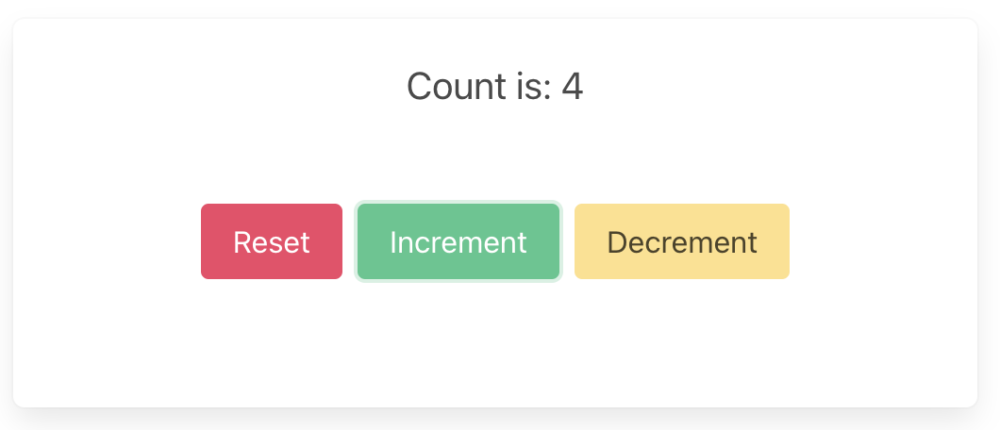

# Desktop/Mobile — Tauri

These are the steps to set up and run a Crux app as a desktop (and mobile)
application using [Tauri](https://tauri.app/). Tauri uses a native webview
to render the UI, with a Rust backend — making it a natural fit for Crux.

```admonish
This walk-through assumes you have already added the `shared` library to your repo, as described in [Shared core and types](../../part-1/shell.md).
```

```admonish info
Tauri apps have a Rust backend (where the Crux core lives) and a web frontend
(React, in this example). Because the core runs directly in the Rust backend
process, there is no need for WebAssembly or FFI — the shell calls the core
directly and communicates with the frontend via Tauri's event system.
```

## Create a Tauri App

Install the Tauri CLI if you haven't already:

```sh
cargo install tauri-cli
```

Create a new Tauri app. Tauri's `init` command will scaffold the project
structure for you — choose React as the frontend framework.

```sh
cargo tauri init
```

## Project structure

A Tauri project has two parts:

- **`src-tauri/`** — the Rust backend, where the Crux core lives
- **`src/`** — the web frontend (React + TypeScript in this example)

### Backend dependencies

Add the `shared` library and Tauri to your `src-tauri/Cargo.toml`:

```toml
{{#include ../../../../examples/counter/tauri/src-tauri/Cargo.toml}}
```

### Frontend dependencies

Your `package.json` should include the Tauri API package for communicating
between the frontend and backend:

```json
{{#include ../../../../examples/counter/tauri/package.json}}
```

## The Rust backend

The Rust backend is where the Crux core runs. We create a static `Core`
instance and expose Tauri commands that forward events to the core. When the
core requests a `Render` effect, we emit a Tauri event to the frontend
with the updated view model.

```rust,noplayground
{{#include ../../../../examples/counter/tauri/src-tauri/src/lib.rs}}
```

A few things to note:

- The `Core` is stored in a `LazyLock<Arc<...>>` so it can be shared across
  Tauri command handlers.
- Each user action (increment, decrement, reset) is a separate Tauri command
  that sends the corresponding event to the core.
- The `Render` effect is handled by calling `app.emit("render", view)`, which
  sends the serialized `ViewModel` to the frontend as a Tauri event.
- Because the core is running directly in Rust, there is no serialization
  boundary between the shell and the core — we call `core.process_event()`
  directly.

## The React frontend

The frontend listens for `render` events from the backend and updates the UI.
User interactions invoke Tauri commands, which run in the Rust backend.

```typescript
{{#include ../../../../examples/counter/tauri/src/App.tsx}}
```

The frontend is straightforward:

- On mount, we call `listen("render", ...)` to receive view model updates from
  the backend, and invoke `reset` to trigger an initial render.
- Button clicks call `invoke("increment")`, `invoke("decrement")`, etc. — these
  are the Tauri commands defined in our Rust backend.
- There is no serialization code in the frontend — Tauri handles the
  serialization of the `ViewModel` struct automatically.

## Build and run

```sh
cargo tauri dev
```

```admonish success
Your app should look like this:

<p align="center"></p>
```
