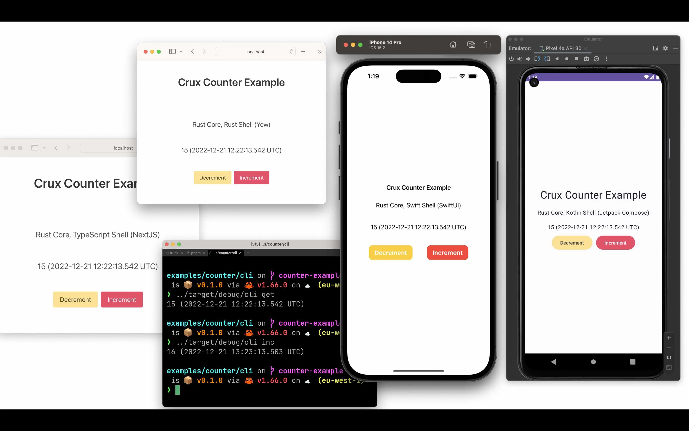

# Crux Counter Example

The Crux Counter example is a simple multi-platform application that calls a
cloud-hosted API.

It makes HTTP requests to a shared global counter hosted at
[https://crux-counter.fly.dev](https://crux-counter.fly.dev), incrementing or
decrementing the counter value.

The [server](./server/) also has an endpoint for Server Sent Events
([https://crux-counter.fly.dev/sse](https://crux-counter.fly.dev/sse)), which
signals when changes are made to the global counter value — so that when you
update the counter in one client, all the other clients will update too.

We have included an example of a
[Server Sent Events capability](./shared/src/capabilities/sse.rs), which uses
the core's ability to stream responses from the shell.



### Notes:

1. Please make sure you have the following rust targets installed (there is a
   [`rust-toolchain.toml`](../../rust-toolchain.toml) in the root directory of
   this repo, so you should be able to type `rustup target list --installed`, in
   or below the root directory, and these targets will be installed if they are
   not already present).

   ```txt
   aarch64-apple-darwin
   aarch64-apple-ios
   aarch64-apple-ios-sim
   aarch64-linux-android
   wasm32-unknown-unknown
   x86_64-apple-ios
   ```

2. This example currently depends on the `pnpm` package manager when generating
   types for TypeScript. We are currently revisiting the type generation for
   foreign types and so this requirement will probably go, but for now, please
   [install `pnpm`](https://pnpm.io/installation).

## Rust shared library

1. Make sure the core builds

   ```sh
   cargo build --package shared
   ```

2. Generate the shared types for your client applications

   ```sh
   cargo build --package shared_types
   ```

## Web app — Yew

If you don't have it already, install the `trunk` CLI tool:

```sh
brew install trunk
```

To build and run the [Yew](https://yew.rs/) web app:

```
cd web-yew
trunk serve
```

## Web app — Leptos

If you don't have it already, install the `trunk` CLI tool:

```sh
brew install trunk
```

To build and run the [Leptos](https://leptos.dev/) web app:

```
cd web-leptos
trunk serve
```

## Web app — Dioxus

If you don't have it already, install the `dx` CLI tool:

```sh
cargo install dioxus-cli
```

To build and run the [Dioxus](https://dioxuslabs.com/) web app:

```
cd web-dioxus
dx serve
```

## Web app — NextJS (React)

To build and run the [NextJS](https://nextjs.org/) web app:

```
cd web-nextjs
pnpm install
pnpm dev
```

### Notes:

On Windows if you get "ℹ️ Installing wasm-pack" it does not work. You can solve
it by installing it manually from:
https://rustwasm.github.io/wasm-pack/installer/

## Mobile app — iOS

You will need [XCode](https://developer.apple.com/xcode/), which you can get in
the Mac AppStore

```
cd iOS
open CounterApp.xcodeproj
```

You should be able to press "Play" to start the app in the simulator, or on an
iPhone.

### Notes:

- You may encounter this error:

  ```
  xcrun: error: invalid active developer path (/Library/Developer/CommandLineTools), missing xcrun at: /Library/Developer/CommandLineTools/usr/bin/xcrun
  ```

  If this happens, then you need to install the
  [Command Line Tools For Xcode](https://developer.apple.com/download/all/).

## Mobile app — Android

Open the `Android` folder in
[Android Studio](https://developer.android.com/studio/). If the build is
successful, you should be able to press "Play" to start the app in the
simulator.

### Notes:

- The Android Studio build might fail for a couple of known reasons:
  - A `linker-wrapper.sh` script failure<br>Ensure you have Python installed and
    your `PATH`
  - `NDK is not installed`<br>Install this via Android Studio --> Settings -->
    Appearance and Behaviour --> System Settings --> Select the "SDK Tools" tab,
    select "NDK (side by side)" and press Apply to install
- If Android studio fails to install `git`, you can set the path to your git
  binary (e.g. the homebrew one) in the preferences under Version Control > Git

## Tauri

To build and run the [Tauri](https://tauri.app/) app:

```
cd tauri
pnpm install
pnpm tauri dev
```
