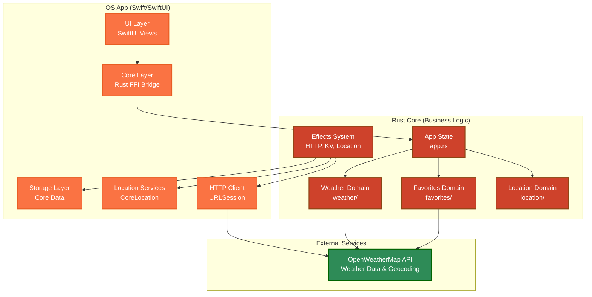
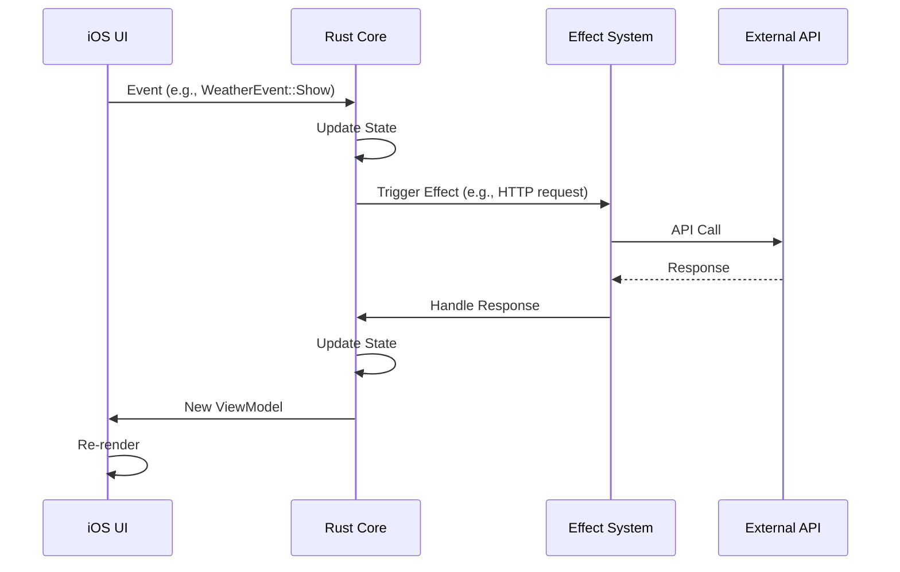
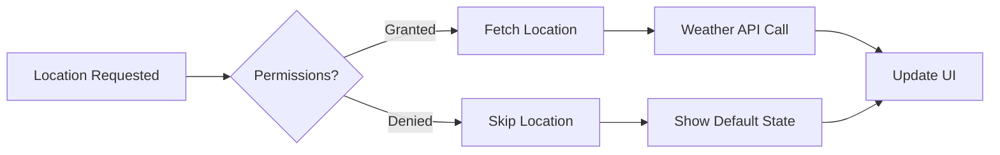
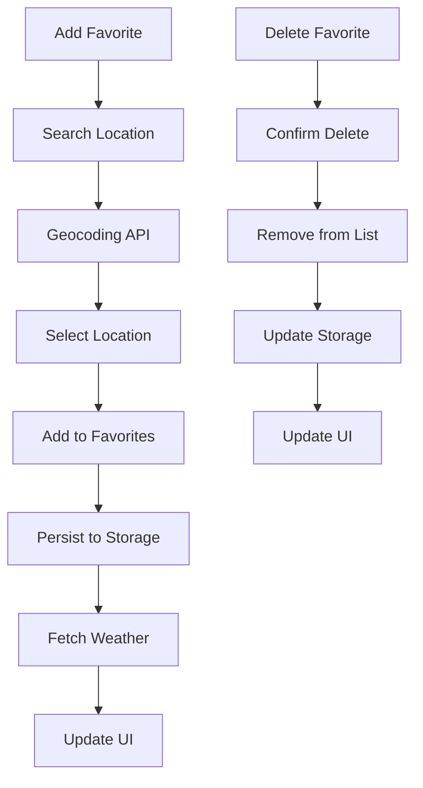

# Weather App Architecture

A comprehensive guide to understanding and demonstrating the Crux Weather App - a cross-platform weather application showcasing modern Rust architecture patterns.

## 🏗️ Architecture Overview

The Weather App is built using the **Crux framework**, demonstrating clean separation between business logic (Rust) and platform-specific UI (iOS/SwiftUI). This architecture enables true cross-platform development while maintaining native user experiences.



## 📁 Project Structure Deep Dive

### Core Rust Logic (`shared/src/`)

```
shared/src/
├── app.rs              # Main application state & workflow management
├── lib.rs              # FFI bridge & exports
├── config.rs           # Configuration (API keys, endpoints)
├── weather/            # Weather domain
│   ├── events.rs       # Weather events & business logic
│   └── model/          # Weather data structures
├── favorites/          # Favorites domain
│   ├── events.rs       # Favorites management logic
│   └── model.rs        # Favorites data structures
└── location/           # Location domain
    ├── capability.rs   # Location services interface
    └── model/          # Location data structures
```

### iOS App (`iOS/Weather/`)

```
iOS/Weather/
├── WeatherApp.swift    # App entry point
├── ContentView.swift   # Main navigation & view switching
├── core.swift          # Rust FFI bridge implementation
├── HomeView.swift      # Weather display view
├── FavoritesView.swift # Favorites management view
├── AddFavoriteView.swift # Location search & add view
└── [Supporting Views]  # Weather cards, icons, etc.
```

## 🔄 Data Flow & State Management

### Event-Driven Architecture

The app follows a unidirectional data flow pattern:



### Workflow State Management

The app uses an enum-based workflow system for clean state management:

```rust
#[derive(Default, Serialize, Deserialize, Clone, Debug, PartialEq)]
pub enum Workflow {
    #[default]
    Home,                           // Main weather view
    Favorites(FavoritesState),      // Favorites management
    AddFavorite,                    // Location search
}

#[derive(Serialize, Deserialize, Clone, Debug, PartialEq)]
pub enum FavoritesState {
    Idle,                           // Normal favorites view
    ConfirmDelete(f64, f64),        // Confirm delete dialog
}
```

## 🏃‍♂️ App Walkthrough

### 1. App Launch & Initial State

**Key Files to Examine:**
- `iOS/Weather/WeatherApp.swift:4-10` - App entry point
- `shared/src/app.rs:104-113` - Initial event handling

**What Happens:**
1. App launches and initializes the Core
2. Triggers `WeatherEvent::Show` 
3. Restores favorites from persistent storage
4. Checks location permissions
5. Fetches current location weather if available

**Code Walkthrough:**
```swift
// iOS/Weather/WeatherApp.swift
@main
struct WeatherApp: App {
    var body: some Scene {
        WindowGroup {
            ContentView(core: Core())  // Initialize Rust core
        }
    }
}
```

```rust
// shared/src/weather/events.rs:48-53
WeatherEvent::Show => Command::event(Event::Favorites(Box::new(FavoritesEvent::Restore)))
    .then(
        is_location_enabled().then_send(|result| {
            Event::Home(Box::new(WeatherEvent::LocationEnabled(result)))
        }),
    ),
```

### 2. Location Services Integration

**Key Files:**
- `iOS/Weather/core.swift:224-346` - Location manager implementation
- `shared/src/location/capability.rs` - Location capability interface

**Demo Points:**
1. **Permission Handling**: App requests location permissions on first launch
2. **Error Handling**: Graceful fallback when location is unavailable
3. **Async Operations**: Non-blocking location requests with timeout

**Location Flow:**


### 3. Weather Data Fetching

**Key Files:**
- `shared/src/weather/events.rs:74-84` - Weather API integration
- `shared/src/weather/model/current_response.rs` - Response data structures

**API Integration:**
```rust
// shared/src/weather/events.rs:74-84
WeatherEvent::Fetch(lat, long) => Http::get(WEATHER_URL)
    .expect_json()
    .query(&CurrentQueryString {
        lat: lat.to_string(),
        lon: long.to_string(),
        units: "metric",
        appid: API_KEY.clone(),
    })
    .expect("could not serialize query string")
    .build()
    .then_send(|result| Event::Home(Box::new(WeatherEvent::SetWeather(Box::new(result))))),
```

**Response Handling:**
```rust
// shared/src/weather/events.rs:85-102
WeatherEvent::SetWeather(result) => {
    let cmd = match *result {
        Ok(mut response) => {
            model.weather_data = response.take_body().unwrap();
            render()
        }
        Err(_) => render(),
    };
    
    // Trigger favorites weather fetch if favorites exist
    if model.favorites.is_empty() {
        cmd
    } else {
        cmd.and(Command::event(Event::Home(Box::new(
            WeatherEvent::FetchFavorites,
        ))))
    }
}
```

### 4. Favorites Management

**Key Files:**
- `shared/src/favorites/events.rs` - Favorites business logic
- `iOS/Weather/FavoritesView.swift` - Favorites UI

**Core Features:**
1. **Add Favorites**: Search locations via geocoding API
2. **Delete Favorites**: Swipe-to-delete with confirmation
3. **Persistence**: Core Data storage for favorites
4. **Weather Updates**: Automatic weather fetching for favorites

**Favorites Flow:**


**Search Implementation:**
```rust
// shared/src/favorites/events.rs:73-82
FavoritesEvent::Search(query) => Http::get(GEOCODING_URL)
    .expect_json()
    .query(&GeocodingQueryString {
        q: query,
        limit: "5",
        appid: API_KEY.clone(),
    })
    .expect("could not serialize query string")
    .build()
    .then_send(|result| FavoritesEvent::SearchResult(Box::new(result))),
```

### 5. Cross-Platform Type Safety

**Key Files:**
- `shared_types/src/lib.rs` - Shared type definitions
- `shared_types/generated/` - Generated bindings

**Type Generation:**
The app uses **UniFFI** and **serde-generate** for type-safe cross-platform communication:

```rust
// shared/src/app.rs:23-28
#[derive(Serialize, Deserialize, Clone, Debug, PartialEq)]
pub enum Event {
    Navigate(Box<Workflow>),
    Home(Box<WeatherEvent>),
    Favorites(Box<FavoritesEvent>),
}
```

Generated Swift types:
```swift
// Generated Swift bindings
public enum Event: Codable {
    case navigate(Workflow)
    case home(WeatherEvent)
    case favorites(FavoritesEvent)
}
```

## 🧪 Testing Strategy

### Unit Tests

**Rust Core Tests:**
- `shared/src/weather/events.rs:149-469` - Weather logic tests
- `shared/src/favorites/events.rs:156-610` - Favorites logic tests

**Test Examples:**
```rust
// shared/src/weather/events.rs:175-235
#[test]
fn test_show_triggers_set_weather() {
    let app = App;
    let mut model = Model::default();
    
    // 1. Trigger the Show event
    let event = Event::Home(Box::new(WeatherEvent::Show));
    let _ = app.update(event, &mut model, &());
    
    // 2. Simulate location enabled
    let event = Event::Home(Box::new(WeatherEvent::LocationEnabled(true)));
    let _ = app.update(event, &mut model, &());
    
    // 3. Simulate location fetch
    let test_location = LocationResponse {
        lat: 33.456_789,
        lon: -112.037_222,
    };
    let event = Event::Home(Box::new(WeatherEvent::LocationFetched(Some(test_location))));
    let mut cmd = app.update(event, &mut model, &());
    
    // 4. Verify HTTP request
    let request = cmd.effects().next().unwrap().expect_http();
    // ... test continues
}
```

### Integration Tests

**Effect Testing:**
```rust
// shared/src/favorites/events.rs:531-578
#[test]
fn test_search_triggers_api_call() {
    let app = App;
    let mut model = Model::default();
    
    let query = "Phoenix";
    let event = Event::Favorites(Box::new(FavoritesEvent::Search(query.to_string())));
    
    let mut cmd = app.update(event, &mut model, &());
    let mut request = cmd.effects().next().unwrap().expect_http();
    
    // Verify the correct API call is made
    assert_eq!(
        &request.operation,
        &HttpRequest::get(GEOCODING_URL)
            .query(&GeocodingQueryString {
                q: query.to_string(),
                limit: "5",
                appid: API_KEY.clone(),
            })
            .expect("could not serialize query string")
            .build()
    );
}
```

## 🔧 Development Setup

### Prerequisites
- Rust 1.80+
- Xcode 14+
- OpenWeatherMap API key

### Quick Start
```bash
# 1. Set API key
export OPENWEATHER_API_KEY=your_api_key_here

# 2. Build Rust core
cd shared && cargo build --release

# 3. Generate bindings
cd ../shared_types && cargo run --release

# 4. Open iOS project
open iOS/Weather.xcodeproj
```

### Running Tests
```bash
# Rust tests
cd shared && cargo test

# iOS tests
# Use Xcode test runner (⌘+U)
```

## 🎯 Key Demo Points

### 1. **Cross-Platform Architecture**
- Show how business logic is shared between platforms
- Demonstrate type-safe FFI bindings
- Explain the benefits of domain-oriented structure

### 2. **Modern Rust Patterns**
- Effect system for side effects
- Event-driven architecture
- Type-safe state management
- Comprehensive error handling

### 3. **Native Integration**
- Location services integration
- Persistent storage with Core Data
- Native HTTP client usage
- Platform-specific UI patterns

### 4. **Developer Experience**
- Comprehensive testing strategy
- Auto-generated type bindings
- Clear separation of concerns
- Excellent debugging capabilities

## 📊 Performance Characteristics

### Memory Usage
- Minimal Rust core overhead
- Efficient data serialization
- Native iOS memory management

### Network Efficiency
- Debounced search queries (TODO: debounce effect?)
- Parallel weather fetching for favorites
- Proper error handling and retry logic (TODO: handle http errors properly rather than render)

### UI Responsiveness
- Non-blocking operations
- Smooth transitions between views
- Async/await patterns throughout

## 🔮 Extension Points

### Adding New Platforms
1. Generate bindings for target platform
2. Implement effect handlers (HTTP, storage, location)
3. Create platform-specific UI
4. Reuse entire Rust core as-is

### Architecture Improvements
- Time capability for debouncing
- More sophisticated state management
- Enhanced error recovery
- Performance monitoring

## 📚 Learning Resources

### Key Concepts
- **Crux Framework**: [github.com/redbadger/crux](https://github.com/redbadger/crux)
- **UniFFI**: [mozilla.github.io/uniffi-rs](https://mozilla.github.io/uniffi-rs/)
- **Effect Systems**: Functional programming concept for managing side effects

### Similar Patterns
- Elm Architecture
- Redux/Flux patterns
- Clean Architecture
- Hexagonal Architecture
