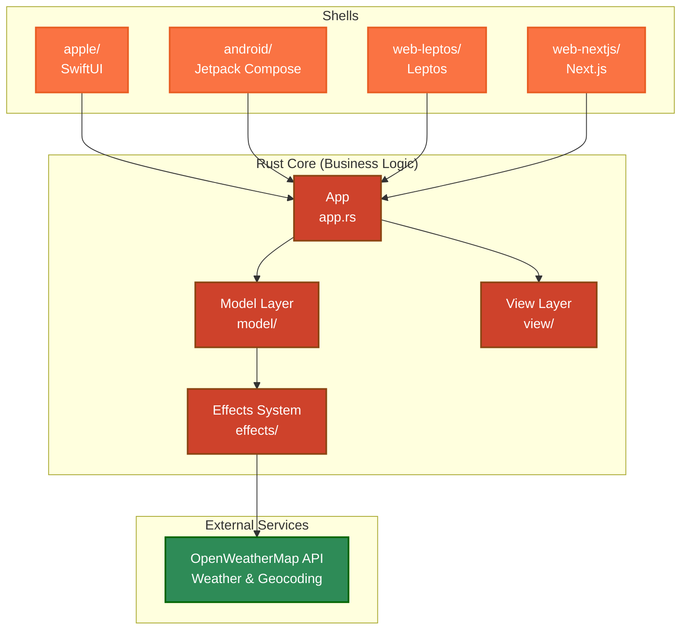
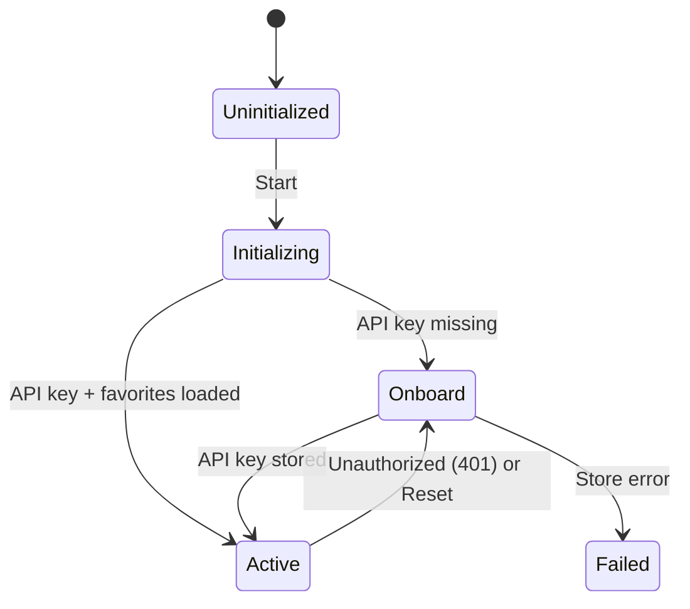
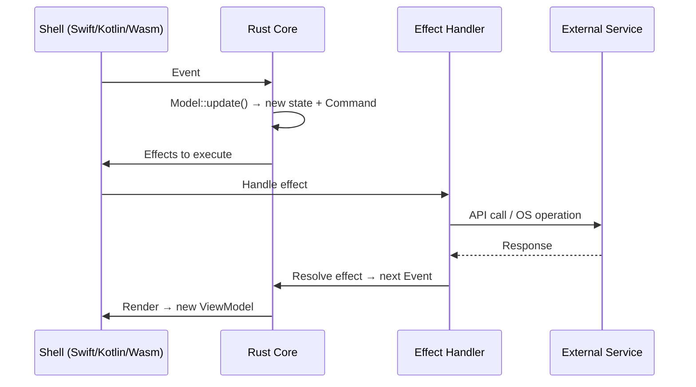

# Weather App Architecture

A comprehensive guide to the Crux Weather App — a cross-platform weather
application showcasing modern Rust architecture patterns.

## Architecture Overview

The Weather App is built using the **Crux framework**, demonstrating clean
separation between business logic (Rust) and platform-specific UI shells
(iOS/SwiftUI, Android/Jetpack Compose, Leptos, Next.js). This architecture
enables true cross-platform development while maintaining native user
experiences.


```mermaid
graph TB
    subgraph "Shells"
        Apple[apple/<br/>SwiftUI]
        Android[android/<br/>Jetpack Compose]
        Leptos[web-leptos/<br/>Leptos]
        NextJS[web-nextjs/<br/>Next.js]
    end

    subgraph "Rust Core (Business Logic)"
        App[App<br/>app.rs]
        Model[Model Layer<br/>model/]
        View[View Layer<br/>view/]
        Effects[Effects System<br/>effects/]
    end

    subgraph "External Services"
        API[OpenWeatherMap API<br/>Weather & Geocoding]
    end

    Apple --> App
    Android --> App
    Leptos --> App
    NextJS --> App
    App --> Model
    App --> View
    Model --> Effects
    Effects --> API

    classDef rust fill:#CE422B,stroke:#8B4513,stroke-width:2px,color:#fff
    classDef shell fill:#FA7343,stroke:#E85D23,stroke-width:2px,color:#fff
    classDef external fill:#2E8B57,stroke:#006400,stroke-width:2px,color:#fff

    class App,Model,View,Effects rust
    class Apple,Android,Leptos,NextJS shell
    class API external
```

## Project Structure

### Core Rust Logic (`shared/src/`)

```
shared/src/
├── app.rs                          # App trait impl — delegates to Model
├── lib.rs                          # Module root & re-exports
├── ffi.rs                          # CoreFFI bridge (uniffi + wasm_bindgen)
├── bin/codegen.rs                  # Type generation binary (facet_typegen)
├── model/
│   ├── mod.rs                      # Top-level Model enum & Event enum, master dispatcher
│   ├── initializing.rs             # Startup: fetches API key + favorites in parallel
│   ├── onboard.rs                  # API key entry screen (Input → Saving → Active)
│   ├── outcome.rs                  # Generic state transition: Status, Started, Outcome
│   ├── versioned_input.rs          # Debounce helper — tracks input versions
│   └── active/
│       ├── mod.rs                  # Active screen container (Home / Favorites)
│       ├── home/
│       │   ├── mod.rs              # Home screen: local weather + favorites list
│       │   ├── local.rs            # Local weather workflow: permission → location → fetch
│       │   └── favorites.rs        # Fetches weather for all saved favorites
│       └── favorites/
│           ├── mod.rs              # Favorites management screen (Add / Delete)
│           ├── model.rs            # Favorite, Favorites collection
│           ├── add.rs              # Add favorite: search with debounce → select
│           └── confirm_delete.rs   # Delete confirmation workflow
├── view/
│   ├── mod.rs                      # ViewModel enum: Loading / Onboard / Active / Failed
│   ├── onboard.rs                  # OnboardViewModel (reason + input state)
│   └── active/
│       ├── mod.rs                  # ActiveViewModel: Home / Favorites
│       ├── home.rs                 # HomeViewModel with local weather + favorites
│       └── favorites.rs            # FavoritesViewModel with workflows
└── effects/
    ├── mod.rs                      # Effect enum: Render, KeyValue, Http, Location, Secret, Time
    ├── http/
    │   ├── mod.rs                  # Http module exports
    │   ├── location.rs             # Geocoding API — search locations by name
    │   └── weather/
    │       ├── mod.rs              # Current weather API — fetch by lat/lon
    │       └── model/              # Response types (CurrentWeatherResponse, etc.)
    ├── location/
    │   ├── mod.rs                  # Location types, LocationOperation, LocationResult
    │   └── command.rs              # is_location_enabled(), get_location() builders
    └── secret/
        ├── mod.rs                  # SecretRequest/Response types, API_KEY_NAME constant
        └── command.rs              # fetch(), store(), delete() command builders
```

### Apple Shell (`apple/`)

```
apple/
├── project.yml                     # XcodeGen project definition
├── WeatherApp/
│   ├── WeatherApp.swift            # @main entry point — inits Core, sends Start event
│   ├── ContentView.swift           # Root view — switches on ViewModel state
│   ├── LiveBridge.swift            # CoreFfi wrapper — bincode serialization boundary
│   ├── Info-iOS.plist
│   └── Info-macOS.plist
└── WeatherKit/                     # Swift package with all views + effect handlers
    └── Sources/WeatherKit/
        ├── Core/
        │   ├── core.swift          # Core class — processes events + dispatches effects
        │   ├── bridge.swift        # CoreBridge protocol
        │   ├── update.swift        # CoreUpdater — environment object for sending events
        │   ├── http.swift          # HTTP effect handler (URLSession)
        │   ├── kv.swift            # KeyValue effect handler
        │   ├── KeyValueStore.swift # Core Data–backed KV store
        │   ├── location.swift      # Location effect handler (CoreLocation)
        │   ├── secret.swift        # Secret effect handler (Keychain)
        │   ├── time.swift          # Time effect handler (timers)
        │   └── logging.swift       # os.log categories
        ├── OnboardView.swift       # API key input screen
        ├── ActiveView.swift        # Dispatches to Home or Favorites
        ├── FailedView.swift        # Error display
        ├── Home/
        │   ├── HomeView.swift      # NavigationSplitView — sidebar + detail
        │   ├── LocationRow.swift   # Sidebar row: name, icon, temps
        │   ├── CurrentLocationRow.swift
        │   ├── WeatherCard.swift   # Detail card: full weather info
        │   ├── WeatherIcon.swift   # Weather code → SF Symbol mapping
        │   ├── WeatherDetailItem.swift
        │   ├── TimeDisplay.swift   # Unix timestamp formatting
        │   ├── LoadingCard.swift
        │   ├── StatusCard.swift
        │   └── WeatherExtensions.swift
        ├── Favorites/
        │   ├── FavoritesView.swift # List + Add/Delete workflows
        │   ├── AddFavoriteView.swift
        │   └── FavoriteCard.swift
        └── Preview/
            └── PreviewData.swift   # Preview helpers + FakeBridge
```

## State Machine

The app is a hierarchical state machine. The top-level `Model` enum defines
five states:

```rust
pub enum Model {
    Uninitialized,
    Initializing(InitializingModel),
    Onboard(OnboardModel),
    Active(ActiveModel),
    Failed(String),
}
```


```mermaid
stateDiagram-v2
    [*] --> Uninitialized
    Uninitialized --> Initializing: Start
    Initializing --> Onboard: API key missing
    Initializing --> Active: API key + favorites loaded
    Onboard --> Active: API key stored
    Onboard --> Failed: Store error
    Active --> Onboard: Unauthorized (401) or Reset
```

### Initializing

On `Event::Start`, the app fetches the stored API key and favorites in
parallel. When both resolve:

- API key present → transition to **Active**
- API key missing → transition to **Onboard** (reason: Welcome)

### Onboard

The user enters their OpenWeatherMap API key. States: `Input` → `Saving`.
The key is persisted via the `Secret` effect (Keychain on Apple, platform
equivalent elsewhere). On success, transitions to **Active**.

The app returns here if the API returns 401 (reason: Unauthorized) or if
the user explicitly resets their key (reason: Reset).

### Active

The main app has two screens managed by `ActiveModel`:

- **Home** — local weather (via device location) + weather for saved favorites
- **Favorites** — manage saved locations (add via search, delete with confirmation)

#### Home Screen

`HomeScreen` composes two sub-workflows:

1. **LocalWeather**: `CheckingPermission` → `FetchingLocation` → `FetchingWeather` → `Fetched`
2. **FavoritesWeather**: fetches weather for all favorites in parallel

#### Favorites Screen

`FavoritesScreen` supports two workflows:

1. **Add**: debounced search (300ms via `Time` effect) → geocoding API → select → persist
2. **ConfirmDelete**: confirmation → remove → persist

## Data Flow

Events flow through a unidirectional loop:


```mermaid
sequenceDiagram
    participant UI as Shell (Swift/Kotlin/Wasm)
    participant Core as Rust Core
    participant Effect as Effect Handler
    participant API as External Service

    UI->>Core: Event
    Core->>Core: Model::update() → new state + Command
    Core->>UI: Effects to execute
    UI->>Effect: Handle effect
    Effect->>API: API call / OS operation
    API-->>Effect: Response
    Effect->>Core: Resolve effect → next Event
    Core->>UI: Render → new ViewModel
```

### Outcome Pattern

Each sub-model's `update()` returns an `Outcome<State, Transition, Event>`:

- **Continue(state, command)** — stay in this sub-model, execute command
- **Complete(transition, command)** — signal the parent to transition

This lets each level of the hierarchy handle its own events independently
while cleanly signaling state transitions upward.

### Event Routing

Events are routed hierarchically:

```
Event::Active(ActiveEvent::Home(HomeEvent::Local(LocalWeatherEvent::WeatherFetched(...))))
```

Each level unwraps and dispatches to the appropriate sub-model.

## Effects

The `Effect` enum defines six effect types:

```rust
#[effect(facet_typegen)]
pub enum Effect {
    Render(RenderOperation),
    KeyValue(KeyValueOperation),
    Http(HttpRequest),
    Location(LocationOperation),
    Secret(SecretRequest),
    Time(TimeRequest),
}
```

| Effect     | Purpose                                      | Shell Implementation (Apple)         |
|------------|----------------------------------------------|--------------------------------------|
| `Render`   | Trigger UI refresh with new ViewModel        | Calls `bridge.currentView()`         |
| `Http`     | Weather + geocoding API calls                | `URLSession`                         |
| `KeyValue` | Persist/restore favorites                    | Core Data                            |
| `Location` | Check permission, get device coordinates     | `CLLocationManager`                  |
| `Secret`   | Store/fetch/delete API key                   | Keychain (`SecItem*`)                |
| `Time`     | Debounce timers for search input             | `Timer` with `MainActor` dispatch    |

## Testing

All model/workflow files include `#[cfg(test)]` modules. Key patterns:

**Outcome assertions:**
```rust
let outcome = model.update(event);
let (state, mut cmd) = outcome.expect_continue().into_parts();
// or
let (transition, mut cmd) = outcome.expect_complete().into_parts();
```

**Effect inspection:**
```rust
let request = cmd.expect_one_effect().expect_http();
let request = cmd.expect_one_effect().expect_secret();
```

**Effect resolution (driving the event loop in tests):**
```rust
let mut http = cmd.expect_one_effect().expect_http();
http.resolve(HttpResult::Ok(HttpResponse::ok().body(json).build()))?;
let event = cmd.expect_one_event();
let outcome = model.update(event);
```

**Parameterized tests (rstest):**
```rust
#[rstest]
#[case::empty("", false)]
#[case::whitespace("  ", false)]
#[case::valid("abc123", true)]
fn can_submit(#[case] input: &str, #[case] expected: bool) { ... }
```

## Development Setup

### Prerequisites

- Rust toolchain ([rustup](https://rustup.rs))
- [just](https://just.systems) command runner
- [OpenWeatherMap](https://openweathermap.org/) API key (entered in-app on
  first launch)

Each shell has additional requirements — run `just doctor` in the shell
directory to check.

### Quick Start

```bash
# 1. Pick a shell and check tools
cd apple
just doctor

# 2. Build
just dev
```

### Running Tests

```bash
cd shared && just test
```
