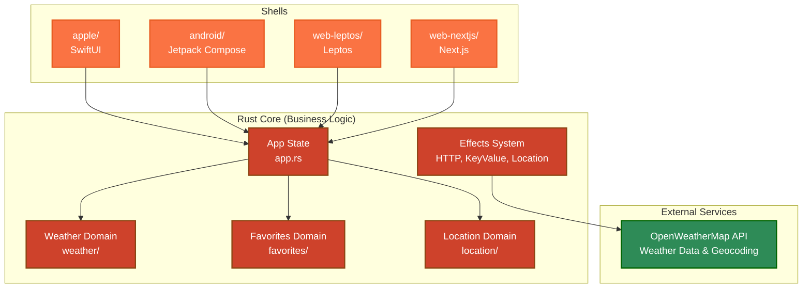
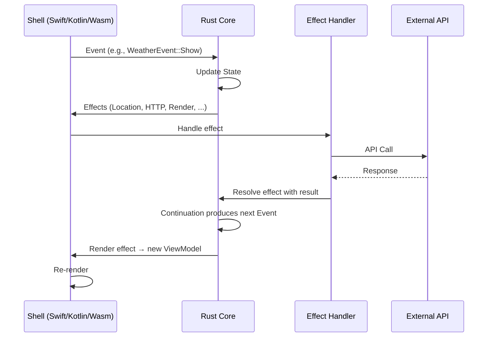
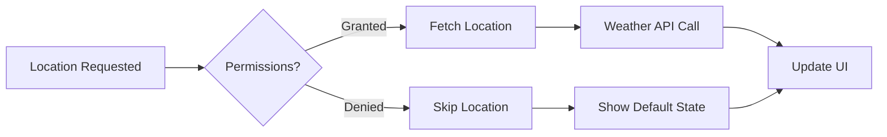
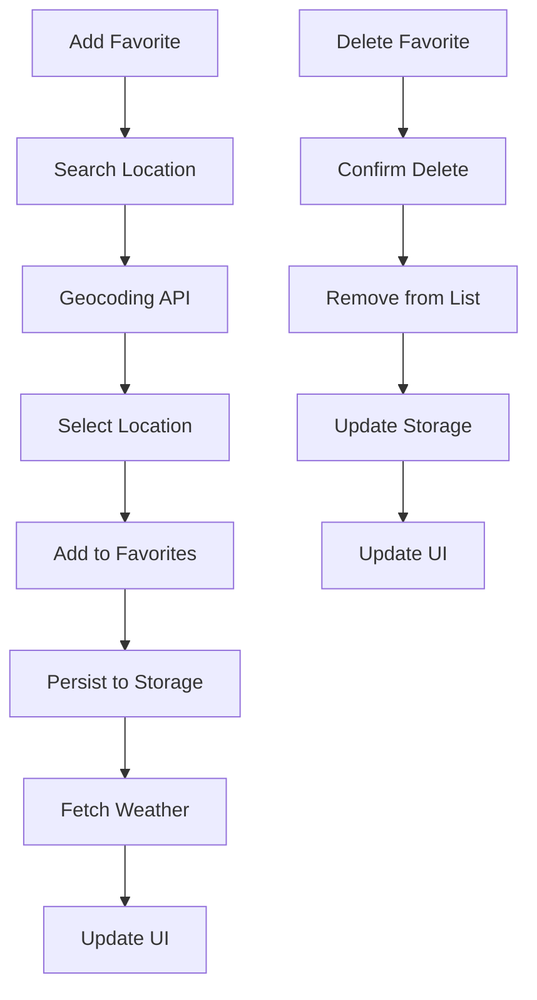

# Weather App Architecture

A comprehensive guide to understanding and demonstrating the Crux Weather App - a cross-platform weather application showcasing modern Rust architecture patterns.

## Architecture Overview

The Weather App is built using the **Crux framework**, demonstrating clean separation between business logic (Rust) and platform-specific UI shells (iOS/SwiftUI, Android/Jetpack Compose, Leptos, Next.js). This architecture enables true cross-platform development while maintaining native user experiences.


```mermaid
graph TB
    subgraph "Shells"
        Apple[apple/<br/>SwiftUI]
        Android[android/<br/>Jetpack Compose]
        Leptos[web-leptos/<br/>Leptos]
        NextJS[web-nextjs/<br/>Next.js]
    end

    subgraph "Rust Core (Business Logic)"
        App[App State<br/>app.rs]
        Weather[Weather Domain<br/>weather/]
        Favorites[Favorites Domain<br/>favorites/]
        Loc[Location Domain<br/>location/]
        Effects[Effects System<br/>HTTP, KeyValue, Location]
    end

    subgraph "External Services"
        API[OpenWeatherMap API<br/>Weather Data & Geocoding]
    end

    Apple --> App
    Android --> App
    Leptos --> App
    NextJS --> App
    App --> Weather
    App --> Favorites
    App --> Loc
    Effects --> API

    classDef rust fill:#CE422B,stroke:#8B4513,stroke-width:2px,color:#fff
    classDef shell fill:#FA7343,stroke:#E85D23,stroke-width:2px,color:#fff
    classDef external fill:#2E8B57,stroke:#006400,stroke-width:2px,color:#fff

    class App,Weather,Favorites,Loc,Effects rust
    class Apple,Android,Leptos,NextJS shell
    class API external
```

## Project Structure

### Core Rust Logic (`shared/src/`)

```
shared/src/
├── app.rs                  # App struct, Event/Effect enums, Model, ViewModel
├── lib.rs                  # Module root & re-exports
├── ffi.rs                  # CoreFFI bridge (uniffi + wasm_bindgen)
├── config.rs               # API key via OPENWEATHER_API_KEY env var
├── bin/codegen.rs          # Type generation binary (facet_typegen)
├── weather/
│   ├── events.rs           # WeatherEvent variants & update function
│   ├── client.rs           # WeatherApi — builds HTTP requests
│   └── model/
│       ├── current_response.rs  # CurrentWeatherResponse, WEATHER_URL
│       └── response_elements/   # Coord, Wind, Clouds, WeatherData
├── favorites/
│   ├── events.rs           # FavoritesEvent variants & update function
│   └── model.rs            # Favorite, Favorites collection, FavoritesState
└── location/
    ├── capability.rs        # LocationOperation effect, is_location_enabled, get_location
    ├── client.rs            # LocationApi — builds geocoding HTTP requests
    └── model/
        └── geocoding_response.rs  # GeocodingResponse, GEOCODING_URL
```

### Apple Shell (`apple/WeatherApp/`)

```
apple/WeatherApp/
├── WeatherApp.swift         # App entry point
├── ContentView.swift        # Main navigation & view switching
├── core.swift               # Core class — FFI bridge + effect handlers
├── HomeView.swift           # Weather display view
├── FavoritesView.swift      # Favorites management view
├── AddFavoriteView.swift    # Location search & add view
├── http.swift               # HTTP request helper
├── KeyValueStore.swift      # UserDefaults-backed key-value store
├── WeatherCard.swift        # Weather card component
├── WeatherIcon.swift        # Weather icon mapping
├── WeatherDetailItem.swift  # Detail row component
├── TimeDisplay.swift        # Sunrise/sunset formatting
└── PlatformColors.swift     # Cross-platform colour definitions
```

## Data Flow & State Management

### Event-Driven Architecture

The app follows a unidirectional data flow pattern:


```mermaid
sequenceDiagram
    participant UI as Shell (Swift/Kotlin/Wasm)
    participant Core as Rust Core
    participant Effect as Effect Handler
    participant API as External API

    UI->>Core: Event (e.g., WeatherEvent::Show)
    Core->>Core: Update State
    Core->>UI: Effects (Location, HTTP, Render, ...)
    UI->>Effect: Handle effect
    Effect->>API: API Call
    API-->>Effect: Response
    Effect->>Core: Resolve effect with result
    Core->>Core: Continuation produces next Event
    Core->>UI: Render effect → new ViewModel
    UI->>UI: Re-render
```

### Workflow State Management

The app uses an enum-based workflow system for clean state management:

```rust
#[derive(Facet, Default, Serialize, Deserialize, Clone, Debug, PartialEq)]
#[repr(C)]
pub enum Workflow {
    #[default]
    Home,                           // Main weather view
    Favorites(FavoritesState),      // Favorites management
    AddFavorite,                    // Location search
}

#[derive(Facet, Serialize, Deserialize, Clone, Default, Debug, PartialEq)]
#[repr(C)]
pub enum FavoritesState {
    #[default]
    Idle,                           // Normal favorites view
    ConfirmDelete(Location),        // Confirm delete dialog
}
```

## App Walkthrough

### 1. App Launch & Initial State

**Key Files to Examine:**
- `apple/WeatherApp/WeatherApp.swift` — App entry point
- `shared/src/app.rs` — `update()` dispatches `WeatherEvent::Show`

**What Happens:**
1. App launches and initializes the Core
2. Triggers `WeatherEvent::Show`
3. Restores favorites from persistent storage
4. Checks location permissions
5. Fetches current location weather if available

**Code Walkthrough:**
```swift
// apple/WeatherApp/WeatherApp.swift
@main
struct WeatherApp: App {
    var body: some Scene {
        WindowGroup {
            ContentView(core: Core())  // Initialize Rust core
        }
    }
}
```

When `Event::Home(WeatherEvent::Show)` arrives, `app.rs` dispatches both a
favorites restore and the weather domain's Show handler in parallel:

```rust
// shared/src/app.rs — update()
Event::Home(home_event) => {
    let mut commands = Vec::new();
    if let WeatherEvent::Show = *home_event {
        commands.push(
            favorites::events::update(FavoritesEvent::Restore, model)
                .map_event(|fe| Event::Favorites(Box::new(fe))),
        );
    }
    commands.push(
        weather::events::update(*home_event, model)
            .map_event(|we| Event::Home(Box::new(we))),
    );
    Command::all(commands)
}
```

The weather domain then checks location services:

```rust
// shared/src/weather/events.rs
WeatherEvent::Show => is_location_enabled().then_send(WeatherEvent::LocationEnabled),
```

### 2. Location Services Integration

**Key Files:**
- `apple/WeatherApp/core.swift` — `handleLocation` and `LocationDelegate`
- `shared/src/location/capability.rs` — Location capability interface

**Demo Points:**
1. **Permission Handling**: App requests location permissions on first launch
2. **Error Handling**: Graceful fallback when location is unavailable
3. **Async Operations**: Non-blocking location requests with timeout

**Location Flow:**

```mermaid
graph LR
    A[Location Requested] --> B{Permissions?}
    B -->|Granted| C[Fetch Location]
    B -->|Denied| D[Skip Location]
    C --> E[Weather API Call]
    D --> F[Show Default State]
    E --> G[Update UI]
    F --> G
```

### 3. Weather Data Fetching

**Key Files:**
- `shared/src/weather/events.rs` — Weather event handling
- `shared/src/weather/client.rs` — `WeatherApi` HTTP client
- `shared/src/weather/model/current_response.rs` — Response data structures

**API Integration:**

The event handler delegates to `WeatherApi::fetch`, which wraps the HTTP call,
deserialises the JSON, and maps errors:

```rust
// shared/src/weather/events.rs
WeatherEvent::Fetch(location) => WeatherApi::fetch(location)
    .then_send(move |result| WeatherEvent::SetWeather(Box::new(result))),
```

```rust
// shared/src/weather/client.rs
pub fn fetch<Effect, Event>(location: Location) -> RequestBuilder<...> {
    Http::get(WEATHER_URL)
        .expect_json::<CurrentWeatherResponse>()
        .query(&CurrentWeatherQuery {
            lat: location.lat.to_string(),
            lon: location.lon.to_string(),
            units: "metric",
            appid: API_KEY.clone(),
        })
        .expect("could not serialize query string")
        .build()
        .map(|result| match result {
            Ok(mut response) => match response.take_body() {
                Some(weather_data) => Ok(weather_data),
                None => Err(WeatherError::ParseError),
            },
            Err(_) => Err(WeatherError::NetworkError),
        })
}
```

**Response Handling:**
```rust
// shared/src/weather/events.rs
WeatherEvent::SetWeather(result) => {
    if let Ok(weather_data) = *result {
        model.weather_data = weather_data;
    }

    // Also fetch weather for any saved favorites
    update(WeatherEvent::FetchFavorites, model).and(render())
}
```

### 4. Favorites Management

**Key Files:**
- `shared/src/favorites/events.rs` — Favorites business logic
- `shared/src/location/client.rs` — `LocationApi` geocoding client
- `apple/WeatherApp/FavoritesView.swift` — Favorites UI (Apple shell)

**Core Features:**
1. **Add Favorites**: Search locations via geocoding API
2. **Delete Favorites**: Swipe-to-delete with confirmation
3. **Persistence**: `crux_kv` (KeyValue) storage for favorites
4. **Weather Updates**: Automatic weather fetching for favorites

**Favorites Flow:**

```mermaid
graph TD
    A[Add Favorite] --> B[Search Location]
    B --> C[Geocoding API]
    C --> D[Select Location]
    D --> E[Add to Favorites]
    E --> F[Persist to Storage]
    F --> G[Fetch Weather]
    G --> H[Update UI]

    I[Delete Favorite] --> J[Confirm Delete]
    J --> K[Remove from List]
    K --> L[Update Storage]
    L --> M[Update UI]
```

**Search Implementation:**

The event handler delegates to `LocationApi::fetch`, which wraps the geocoding
HTTP call:

```rust
// shared/src/favorites/events.rs
FavoritesEvent::Search(query) => LocationApi::fetch(&query)
    .then_send(|result| FavoritesEvent::SearchResult(Box::new(result))),
```

**Persistence via `crux_kv`:**
```rust
// shared/src/favorites/events.rs
FavoritesEvent::Restore => KeyValue::get(FAVORITES_KEY)
    .then_send(FavoritesEvent::Load),
```

### 5. Cross-Platform Type Safety

**Key Files:**
- `shared/src/app.rs` — Event, Effect, ViewModel types annotated with `Facet`
- `shared/src/ffi.rs` — `CoreFFI` bridge (`#[uniffi::Object]` + `#[wasm_bindgen]`)
- `shared/src/bin/codegen.rs` — Type generation binary using `facet_typegen`

**Type Generation:**
The app uses the **Facet** derive macro for type-safe cross-platform communication.
Running `just typegen` in a shell directory invokes the codegen binary, which
generates Swift, Kotlin, or TypeScript types from the annotated Rust types:

```rust
// shared/src/app.rs
#[derive(Facet, Serialize, Deserialize, Clone, Debug, PartialEq)]
#[repr(C)]
pub enum Event {
    Navigate(Box<Workflow>),
    Home(Box<WeatherEvent>),
    Favorites(Box<FavoritesEvent>),
}
```

For Apple shells, **UniFFI** generates the FFI scaffolding so that Swift can
call into the `CoreFFI` struct defined in `ffi.rs`. For web shells,
**wasm_bindgen** provides the equivalent bridge.

## Testing Strategy

### Unit Tests

**Rust Core Tests:**
- `shared/src/weather/events.rs` — Weather logic tests (Show → Location → Fetch → SetWeather chain)
- `shared/src/favorites/events.rs` — Favorites tests (search, add, duplicate detection, delete, KV persistence)
- `shared/src/app.rs` — Navigation tests

Tests use Crux's command testing helpers (`expect_one_effect`, `expect_http`,
`expect_location`, `resolve`, etc.) to drive the event/effect loop without
running a real shell.

**Test Example — weather fetch chain:**
```rust
// shared/src/weather/events.rs
#[test]
fn test_show_triggers_set_weather() {
    let mut model = Model::default();

    // 1. Trigger the Show event
    let mut cmd = update(WeatherEvent::Show, &mut model);

    let mut location = cmd.expect_one_effect().expect_location();
    assert_eq!(location.operation, LocationOperation::IsLocationEnabled);

    // 2. Simulate location enabled
    location.resolve(LocationResult::Enabled(true)).expect("to resolve");
    let event = cmd.expect_one_event();
    let mut cmd = update(event, &mut model);

    let mut location = cmd.expect_one_effect().expect_location();
    assert_eq!(location.operation, LocationOperation::GetLocation);

    // 3. Simulate location fetch
    let test_location = Location { lat: 33.456_789, lon: -112.037_222 };
    location.resolve(LocationResult::Location(Some(test_location))).expect("to resolve");
    let event = cmd.expect_one_event();
    let mut cmd = update(event, &mut model);

    // 4. Verify HTTP request
    let mut request = cmd.expect_one_effect().expect_http();
    assert_eq!(&request.operation, &WeatherApi::build(test_location));
    // ... resolves HTTP, verifies model update
}
```

**Test Example — favorites search:**
```rust
// shared/src/favorites/events.rs
#[test]
fn test_search_triggers_api_call() {
    let app = Weather;
    let mut model = Model::default();

    let query = "Phoenix";
    let event = Event::Favorites(Box::new(FavoritesEvent::Search(query.to_string())));

    let mut cmd = app.update(event, &mut model);
    let mut request = cmd.effects().next().unwrap().expect_http();

    // Verify the correct geocoding API call is made
    assert_eq!(&request.operation, &LocationApi::build(query));
}
```

## Development Setup

### Prerequisites
- Rust toolchain ([rustup](https://rustup.rs))
- [OpenWeatherMap](https://openweathermap.org/) API key

Each shell has additional requirements — run `just doctor` in the shell
directory to check.

### Quick Start
```bash
# 1. Set API key
export OPENWEATHER_API_KEY=your_api_key_here

# 2. Pick a shell and check tools
cd apple
just doctor

# 3. Build
just dev
```

### Running Tests
```bash
cd shared && just test
```

## Key Demo Points

### 1. **Cross-Platform Architecture**
- Show how business logic is shared between platforms
- Demonstrate type-safe FFI bindings
- Explain the benefits of domain-oriented structure

### 2. **Modern Rust Patterns**
- Effect system for side effects
- Event-driven architecture
- Type-safe state management
- Comprehensive error handling

### 3. **Native Integration**
- Location services integration
- Persistent storage with `crux_kv`
- Native HTTP client usage
- Platform-specific UI patterns

### 4. **Developer Experience**
- Comprehensive testing strategy
- Auto-generated type bindings
- Clear separation of concerns
- Excellent debugging capabilities

## Performance Characteristics

### Memory Usage
- Minimal Rust core overhead
- Efficient data serialization
- Native iOS memory management

### Network Efficiency
- Debounced search queries (TODO: debounce effect?)
- Parallel weather fetching for favorites
- Proper error handling and retry logic (TODO: handle http errors properly rather than render)

### UI Responsiveness
- Non-blocking operations
- Smooth transitions between views
- Async/await patterns throughout

## Extension Points

### Adding New Platforms
1. Generate bindings for target platform
2. Implement effect handlers (HTTP, storage, location)
3. Create platform-specific UI
4. Reuse entire Rust core as-is

### Architecture Improvements
- Time capability for debouncing
- More sophisticated state management
- Enhanced error recovery
- Performance monitoring

## Learning Resources

### Key Concepts
- **Crux Framework**: [github.com/redbadger/crux](https://github.com/redbadger/crux)
- **UniFFI**: [mozilla.github.io/uniffi-rs](https://mozilla.github.io/uniffi-rs/)
- **Effect Systems**: Functional programming concept for managing side effects

### Similar Patterns
- Elm Architecture
- Redux/Flux patterns
- Clean Architecture
- Hexagonal Architecture
